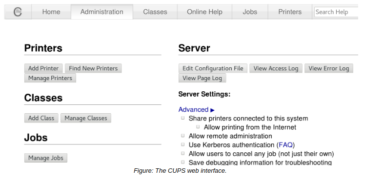

# Printing Software, CUPS And THE lpr COMMAND

#### Printing Software

Printers are typically bundled with software utilities that enable you to configure settings for the printer. These utilities may target a specific operating system, so you need to confirm whether or not they were designed to run on Linux. Even if you cannot run the manufacturer's software utilities, you may still be able to work with the printer through a Linux utility. Major vendors will usually provide the most up-to-date drivers for download off their websites.

#### CUPS

**_CUPS_** is a print management system for Linux that enables a computer to function as a print server. A system running CUPS is a host that can initiate print jobs from client systems. These jobs are then processed and sent to the appropriate printer. The main advantage of CUPS is that it can process different data formats on the same print server.

CUPS is designed for scheduling print jobs, processing administrative commands, and providing printer status information to local and remote programs. CUPS provides a web-based interface for configuring the service. Changes made through this interface modify the `/etc/cups/cupsd.conf` and `/etc/cups/cups-files.conf` files.

> _Note: CUPS used to stand for Common Unix Printing System and was developed by Apple._

#### THE lpr COMMAND

The `lpr` command submits files for printing. Files supplied at the command-line are sent to the specified printer or to the print queue if the printer is busy. Without specifying the printer to use, the command will send the print job to the default printer, which you can configure with CUPS. The lpr command reads the print file from standard input if no files are supplied at the command-line.

**_SYNTAX_**  
The syntax of the `lpr` command is `lpr [options] [file names]`

**_lpr COMMAND OPTIONS_**  
The lpr command options are described in the following table.

Option | Used To
----- | -------
\-E | Force encryption when connecting to the server.
\-P {destination} | Send the print job to the destination printer specified.
\-# {copies} | Set the number of copies to print from 1 to 100.
\-T {name} | Set the job name.
\-l | Specify that the print file is already formatted and should be sent to the destination without being filtered.
\-o {option} | Set a job option, like printing in landscape mode, scaling the printed output, printing double-sided, etc. Job options vary depending on the printer.
\-p | Print the specified files with a shaded header that includes the date, time, job name, and page number.
\-r | Specify that the printed files should be deleted after printing.