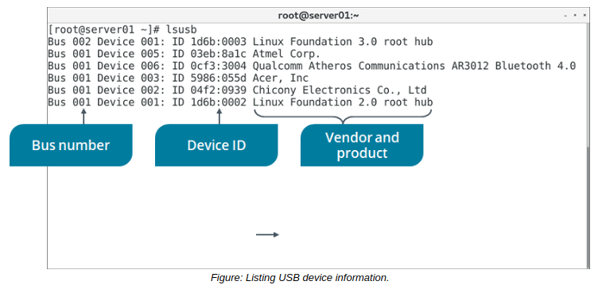

# Monitor Devices

> **EXAM OBJECTIVES COVERED**
> 
> _2.7 Explain the use and operation of Linux devices._

Now that your device configurations are in place, you'll need to monitor those devices to ensure they are recognized by the system and performing as expected. So, in this topic, you'll gather information about connected hardware.

#### THE lsdev COMMAND

The `lsdev` command displays various information about a system's hardware as reported by the kernel. It compiles this information from three files in the `/proc/` directory:

-   `/proc/interrupts` —This file lists each logical CPU core and its associated interrupt requests (IRQ). An IRQ is a signal sent by a device to the processor so that the processor can stop what it is doing and handle some task that the hardware needs to perform, like pressing a keystroke or moving the mouse. There are multiple IRQ addresses that signals can be sent along, and for each address, this file lists how many signals were sent to each CPU core along that address. It also names the hardware device that is mapped to each IRQ address.
-   `/proc/ioports` —This file lists I/O ports and the hardware devices that are mapped to them.
-   `/proc/dma` —This file lists all Industry Standard Architecture (ISA) director memory access (DMA) channels on the system. ISA DMA is a hardware controller that typically supports legacy technology like floppy disks.
    
    > _Note: The `lsdev` command is more common on Debian-based distributions and is available from the `procinfo` package._
    

#### THE lsusb COMMAND

The `lsusb` command is used to display information about devices that are connected to the system's USB buses. This command scans the `/dev/bus/usb/` directory for information. By default, the command will print the number of the bus and the connected device, the ID of the device, and the name of the vendor and product matching that device.

You can use the -v flag to see detailed information about each device, similar to using the udevadm info command. You can also filter results by bus (-s) and by vendor/product (-d).

**_SYNTAX_**  
The syntax of the `lsusb` command is `lsusb [options]`