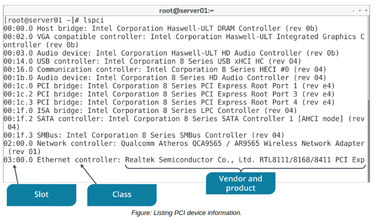
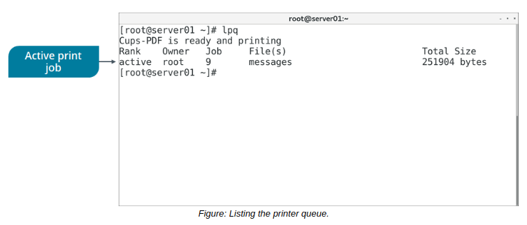

# THE lspci, lpq COMMAND And Additional Device Monitoring Tools

#### THE lspci COMMAND

The `lspci` command is used to display information about devices that are connected to the system's PCI buses. By default, the output will list the logical slot address (typically in the format Bus:Device.Function), the device's class (such as network controller, storage controller, input device, or bridge device), the vendor name, and the device name. Like lsusb, lspci offers a verbose mode for more detailed information about each device. For example, you can use verbose mode to identify the physical slot in which an adapter is installed.

**_SYNTAX_**  
The syntax of the `lspci` command is `lspci [options]`

#### THE lpq COMMAND

The `lpq` command shows the status of the printer queue. By default, it will report each print job's rank in the queue, who owns the job, the job number, the files in the job, and the size of the job. You can also have the report update every number of seconds that you specify with the +interval option, until the queue is empty. If you don't specify the printer to monitor, the lpq command will monitor the default printer.

**_SYNTAX_**  
The syntax of the `lpq` command is `lpq [options]`

#### Additional Device Monitoring Tools

Some tools you've already used thus far can also be useful in monitoring hardware devices. For example, you can use `lsblk` to identify block storage devices connected to the system. The output of this command can help you ensure that your storage devices are recognized and that they are correctly partitioned and mounted.

Another example is the dmesg command. Recall that this prints all messages sent to the kernel's message buffer after system boot, including messages sent by device drivers. If hardware devices encounter errors in operation or are unable to load the expected modules into the kernel, the output of dmesg might indicate so. Use this output to monitor for issues related to device drivers and the underlying hardware they control.