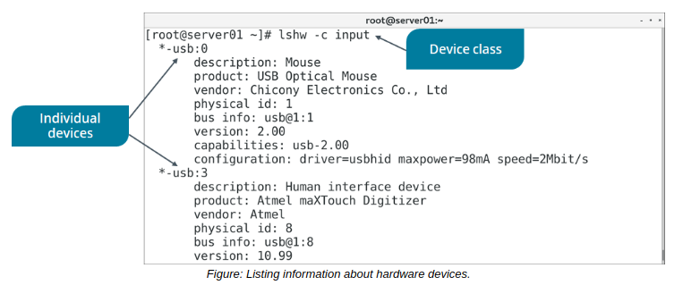

# THE lshw And dmidecode COMMAND

#### THE lshw COMMAND

The `lshw` command lists each detected hardware component on the system and provides details about each device. The command pulls information from many different files in multiple device file locations like /proc/ and outputs in a hierarchical format. Information that lshw outputs includes the vendor, product name, capacity, speed, and many other attributes of the motherboard, CPU, RAM modules, peripheral devices, storage devices, and so on.

Like other commands and files that retrieve device information, you can use lshw to identify whether or not a device is recognized by the kernel, as well as to review a device's capabilities and characteristics.

> _Note: Depending on the version, the `lshw` command may not detect FireWire devices. Check its man page to verify._

**_SYNTAX_**  
The syntax of the `lshw` command is `lshw [options]`

**_DEVICE CLASSES_**  
The output of `lshw` groups devices into one of several classes. You can filter the total results by specifying a class with the -c option. For example, issuing `lshw -c` network will only output details about network-class devices. To see a list of classes currently in use on your system, enter `lshw -short | sort -k2` to generate a non-detailed list of devices, sorted by the class column.

#### THE dmidecode COMMAND

The dmidecode command dumps the system's Desktop Management Interface (DMI) table and presents it in a human-readable format. The DMI table is an industry standard for tracking information about hardware components. It separates components into types, with each type given a number—for example, type 4 is a processor, type 39 is a power supply, etc. Like similar commands, you can use dmidecode to verify connected devices and whether or not they support certain features. However, the authors of dmidecode caution that the information in DMI tables is, more often than not, "inaccurate, incomplete, or simply wrong." Therefore, don't rely on DMI tables as the sole source of hardware information.

**_SYNTAX_**  

The syntax of the `dmidecode` command is `dmidecode [options]`