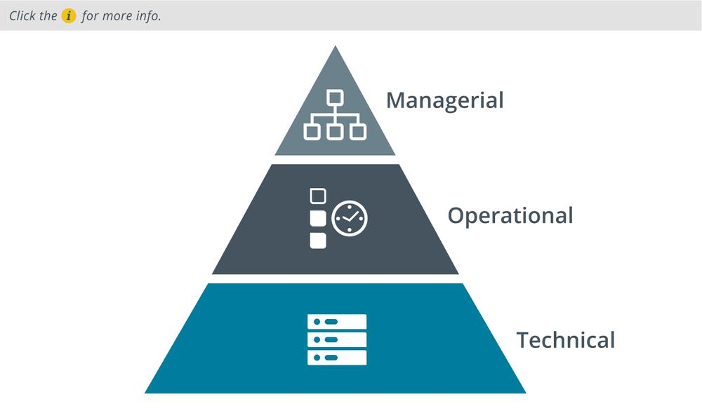

# Security Control Categories

#### SECURITY CONTROL CATEGORIES

Information and cybersecurity assurance is usually considered to take place within an overall process of business risk management. Implementation of cybersecurity functions is often the responsibility of the IT department. There are many different ways of thinking about how IT services should be governed to fulfill overall business needs. Some organizations have developed IT service frameworks to provide best practice guides to implementing IT and cybersecurity. These frameworks can shape company policies and provide checklists of procedures, activities, and technologies that should ideally be in place. Collectively, these procedures, activities, and tools can be referred to as security controls.

A **security control** is something designed to give a system or data asset the properties of confidentiality, integrity, availability, and non-repudiation. Controls can be divided into three broad categories, representing the way the control is implemented:

-   **Technical**—the control is implemented as a system (hardware, software, or firmware). For example, firewalls, antivirus software, and OS access control models are technical controls. Technical controls may also be described as logical controls.
-   **Operational**—the control is implemented primarily by people rather than systems. For example, security guards and training programs are operational controls rather than technical controls.
-   **Managerial**—the control gives oversight of the information system. Examples could include risk identification or a tool allowing the evaluation and selection of other security controls.

Although it uses a more complex scheme, it is worth being aware of the way the National Institute of Standards and Technology (NIST) classifies security controls _(nvlpubs.nist.gov/nistpubs/SpecialPublications/NIST.SP.800-53r4.pdf)._
