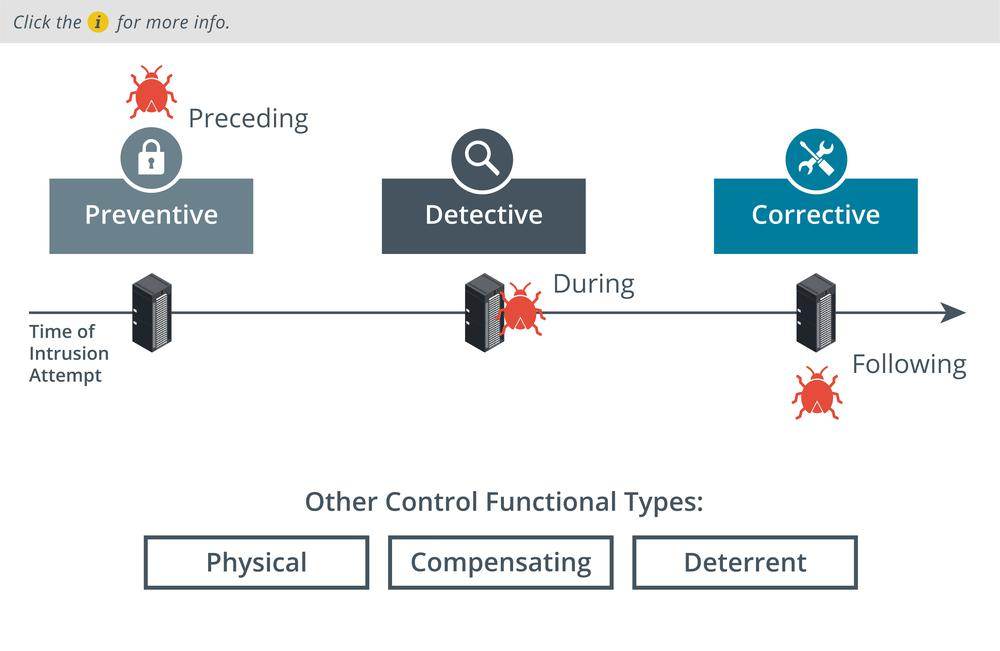

# Security Control Functional Types

#### SECURITY CONTROL FUNCTIONAL TYPES

Security controls can also be classified in types according to the goal or function they perform:

-   **Preventive**—the control acts to eliminate or reduce the likelihood that an attack can succeed. A preventative control operates before an attack can take place. Access control lists (ACL) configured on firewalls and file system objects are preventative-type controls. Anti-malware software also acts as a preventative control, by blocking processes identified as malicious from executing. Directives and standard operating procedures (SOPs) can be thought of as administrative versions of preventative controls.
-   **Detective**—the control may not prevent or deter access, but it will identify and record any attempted or successful intrusion. A detective control operates during the progress of an attack. Logs provide one of the best examples of detective-type controls.
-   **Corrective**—the control acts to eliminate or reduce the impact of an intrusion event. A corrective control is used after an attack. A good example is a backup system that can restore data that was damaged during an intrusion. Another example is a patch management system that acts to eliminate the vulnerability exploited during the attack.

While most controls can be classed functionally as preventative, detective, or corrective, a few other types can be used to define other cases:

-   **Physical**—controls such as alarms, gateways, locks, lighting, security cameras, and guards that deter and detect access to premises and hardware are often classed separately.
-   **Deterrent**—the control may not physically or logically prevent access, but psychologically discourages an attacker from attempting an intrusion. This could include signs and warnings of legal penalties against trespass or intrusion.
-   **Compensating**—the control serves as a substitute for a principal control, as recommended by a security standard, and affords the same (or better) level of protection but uses a different methodology or technology.

