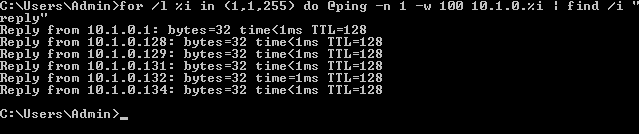

# ipconfig, ping, and ARP

IPCONFIG, PING, AND ARP

The process of mapping out the attack surface is referred to as network reconnaissance and discovery. Reconnaissance techniques are used by threat actors, but they can also be used by security professionals to probe and test their own security systems, as part of a security assessment and ongoing monitoring.

_Topology discovery_ (or "**footprinting**") means scanning for hosts, IP ranges, and routes between networks to map out the structure of the target network. Topology discovery can also be used to build an asset database and to identify non-authorized hosts (rogue system detection) or network configuration errors.

Basic topology discovery tasks can be accomplished using the command line tools built into Windows and Linux. The following tools report the IP configuration and test connectivity on the local network segment or subnet.

-   **ipconfig**—show the configuration assigned to network interface(s) in Windows, including the hardware or media access control (MAC) address, IPv4 and IPv6 addresses, default gateway, and whether the address is static or assigned by DHCP. If the address is DHCP-assigned, the output also shows the address of the DHCP server that provided the lease.
    
-   **ifconfig**—show the configuration assigned to network interface(s) in Linux.
    
-   **ping**—probe a host on a particular IP address or host name using **Internet Control Message Protocol (ICMP)**. You can use `ping` with a simple script to perform a sweep of all the IP addresses in a subnet. The following example will scan the 10.1.0.0/24 subnet from a Windows machine:
    

`for /l %i in (1,1,255) do @ping -n 1 -w 100 10.1.0.%i | find /i "reply"`

_Performing a ping sweep in Windows with a For loop—Searching multiple octets requires nested loops. Note that not all hosts respond to ICMP probes. (Screenshot used with permission from Microsoft.)_

-   `arp`—display the local machine's Address Resolution Protocol (ARP) cache. The ARP cache shows the **MAC address** of the interface associated with each IP address the local host has communicated with recently. This can be useful if you are investigating a suspected spoofing attack. For example, a sign of a man-in-the-middle attack is where the MAC address of the default gateway IP listed in the cache is not the legitimate router's MAC address.

> _For more information about commands, including syntax usage, look up the command in an online resource for Windows ([docs.microsoft.com/en-us/windows-server/administration/windows-commands/windows-commands) or Linux (linux.die.net/man](https://course.adinusa.id/sections/ipconfig-ping-and-arp))._