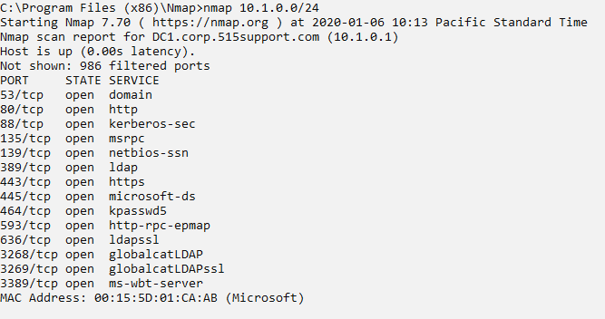

# IP Scanners and Nmap

IP SCANNERS AND NMAP

Scanning a network using tools such as ping is time consuming and non-stealthy, and does not return detailed results. Most topology discovery is performed using a dedicated IP scanner tool. An IP scanner performs host discovery and identifies how the hosts are connected together in an internetwork. For auditing, there are enterprise suites, such as Microsoft's System Center products. Such suites can be provided with credentials to perform authorized scans and obtain detailed host information via management protocols, such as the **Simple Network Management Protocol (SNMP).**

The **Nmap Security Scanner** ([nmap.org](https://course.adinusa.id/sections/ip-scanners-and-nmap)) is one of the most popular open-source IP scanners. Nmap can use diverse methods of host discovery, some of which can operate stealthily and serve to defeat security mechanisms such as firewalls and intrusion detection. The tool is open-source software with packages for most versions of Windows, Linux, and macOS. It can be operated with a command line or via a GUI (Zenmap).

The basic syntax of an Nmap command is to give the IP subnet (or IP host address) to scan. When used without switches like this, the default behavior of Nmap is to ping and send a TCP ACK packet to ports 80 and 443 to determine whether a host is present. On a local network segment, Nmap will also perform ARP and ND (Neighbor Discovery) sweeps. If a host is detected, Nmap performs a port scan against that host to determine which services it is running.

_Nmap default scan listing open ports from within the default range. (Screenshot Nmap [nmap.org](https://course.adinusa.id/sections/ip-scanners-and-nmap).)_

> _This OS fingerprinting can be time-consuming on a large IP scope and is also non-stealthy. If you want to perform only host discovery, you can use Nmap with the -sn switch (or -sP in earlier versions) to suppress the port scan._