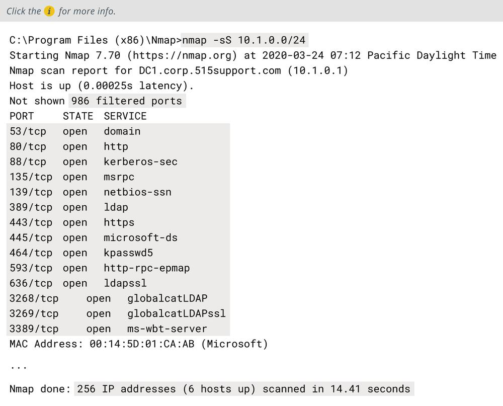
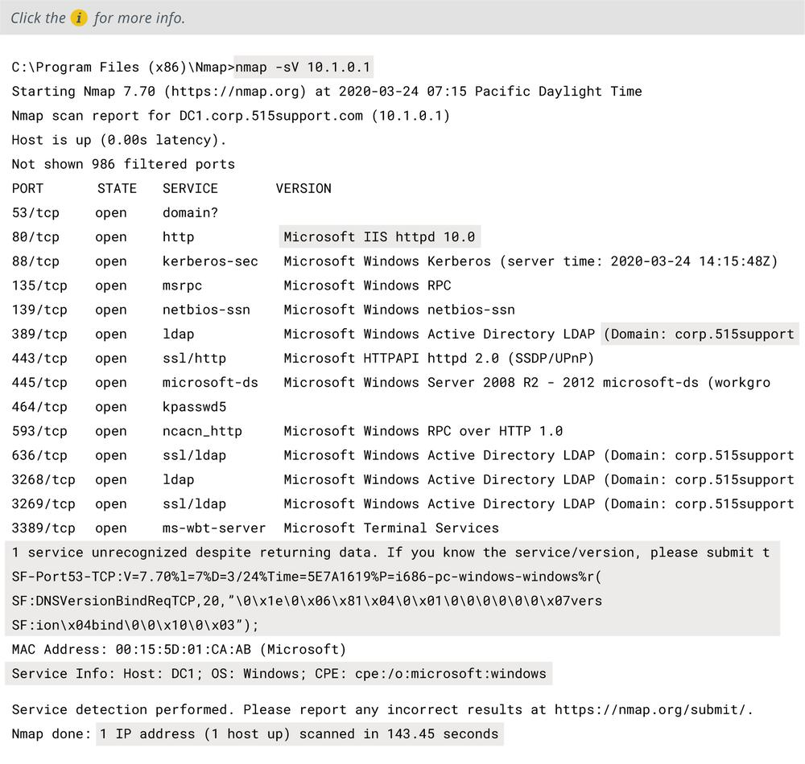

# Service Discovery and Nmap

SERVICE DISCOVERY AND NMAP

Having identified active IP hosts on the network and gained an idea of the network topology, the next step in network reconnaissance is to work out which operating systems are in use, which network services each host is running, and, if possible, which application software is underpinning those services. This process is described as **service discovery**. Service discovery can also be used defensively, to probe potential rogue systems and identify the presence of unauthorized network service ports.

**Service Discovery with Nmap**  
When Nmap completes a host discovery scan, it will report on the state of each port scanned for each IP address in the scope. At this point, you can run additional service discovery scans against one or more of the active IP addresses. Some of the principal options for service discovery scans are:

-   TCP SYN (`-sS`)—this is a fast technique also referred to as half-open scanning, as the scanning host requests a connection without acknowledging it. The target's response to the scan's SYN packet identifies the port state.
-   UDP scans (`-sU`)—scan UDP ports. As these do not use ACKs, Nmap needs to wait for a response or timeout to determine the port state, so UDP scanning can take a long time. A UDP scan can be combined with a TCP scan.
-   Port range (`-p`)—by default, Nmap scans 1000 commonly used ports, as listed in its configuration file. Use the `-p` argument to specify a port range.

**Service and Version Detection and OS Fingerprinting with Nmap**  
The detailed analysis of services on a particular host is often called **fingerprinting**. This is because each OS or application software that underpins a network service responds to probes in a unique way. This allows the scanning software to guess at the software name and version, without having any sort of privileged access to the host. This can also be described as banner grabbing, where the banner is the header of the response returned by the application.

When services are discovered, you can use Nmap with the `-sV` or `-A` switch to probe a host more intensively to discover the following information:

-   Protocol—do not assume that a port is being used for its "well known" application protocol. Nmap can scan traffic to verify whether it matches the expected signature (HTTP, DNS, SMTP, and so on).
-   Application name and version—the software operating the port, such as Apache web server or Internet Information Services (IIS) web server.
-   OS type and version—use the `-O` switch to enable OS fingerprinting (or `-A` to use both OS fingerprinting and version discovery).
-   Device type—not all network devices are PCs. Nmap can identify switches and routers or other types of networked devices, such as NAS boxes, printers, and webcams.

_Nmap fingerprinting scan results._

Nmap comes with a database of application and version fingerprint signatures, classified using a standard syntax called Common Platform Enumeration (CPE). Unmatched responses can be submitted to a web URL for analysis by the community .