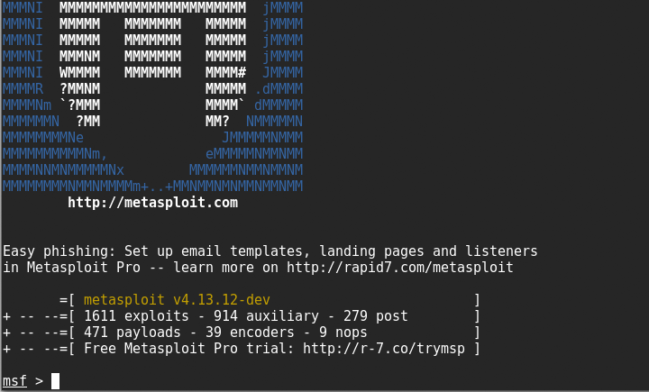

# Exploitation Frameworks

EXPLOITATION FRAMEWORKS

A **remote access trojan (RAT)** is malware that gives an adversary the means of remotely accessing the network. From the perspective of security posture assessment, a penetration tester might want to try to establish this sort of connection and attempt to send corporate information over the channel (data exfiltration). If security controls are working properly, this attempt should be defeated (or at least detected).

An **exploitation framework** uses the vulnerabilities identified by an automated scanner and launches scripts or software to attempt to deliver matching exploits. This might involve considerable disruption to the target, including service failure, and risk data security.

The framework comprises a database of exploit code, each targeting a particular CVE (Common Vulnerabilities and Exposures). The exploit code can be coupled with modular payloads. Depending on the access obtained via the exploit, the payload code may be used to open a command shell, create a user, install software, and so on. The custom exploit module can then be injected into the target system. The framework may also be able to obfuscate the code so that it can be injected past an intrusion detection system or antivirus software.

The best-known exploit framework is **Metasploit** ([metasploit.com](https://course.adinusa.id/sections/exploitation-frameworks)). The platform is open-source software, now maintained by Rapid7. There is a free framework (command line) community edition with installation packages for Linux and Windows. Rapid7 produces pro and express commercial editions of the framework and it can be closely integrated with the Nexpose vulnerability scanner.

_Metasploit Framework Console. (Screenshot used with permission from [metasploit.com](https://course.adinusa.id/sections/exploitation-frameworks).)_

**Sn1per** ([github.com/1N3/Sn1per](https://course.adinusa.id/sections/exploitation-frameworks)) is a framework designed for penetration test reporting and evidence gathering. It can integrate with other tools such as Metasploit and Nikto to run automated suites of tests. Results can be displayed as web reports.

There are many other exploitation frameworks targeting different kinds of vulnerabilities. Some examples include:

-   fireELF—injecting fileless exploit payloads into a Linux host ([github.com/rek7/fireELF](https://course.adinusa.id/sections/exploitation-frameworks)).
-   RouterSploit—vulnerability scanning and exploit modules targeting embedded systems ([github.com/threat9/routersploit](https://course.adinusa.id/sections/exploitation-frameworks)).
-   Browser Exploitation Framework (BeEF)—recovering web session information and exploiting client-side scripting ([beefproject.com](https://course.adinusa.id/sections/exploitation-frameworks)).
-   Zed Attack Proxy (ZAP)—scanning tools and scripts for web application and mobile app security testing ([owasp.org/www-project-zap](https://course.adinusa.id/sections/exploitation-frameworks)).
-   Pacu—scanning and exploit tools for reconnaissance and exploitation of Amazon Web Service (AWS) accounts ([rhinosecuritylabs.com/aws/pacu-open-source-aws-exploitation-framework](https://course.adinusa.id/sections/exploitation-frameworks)).