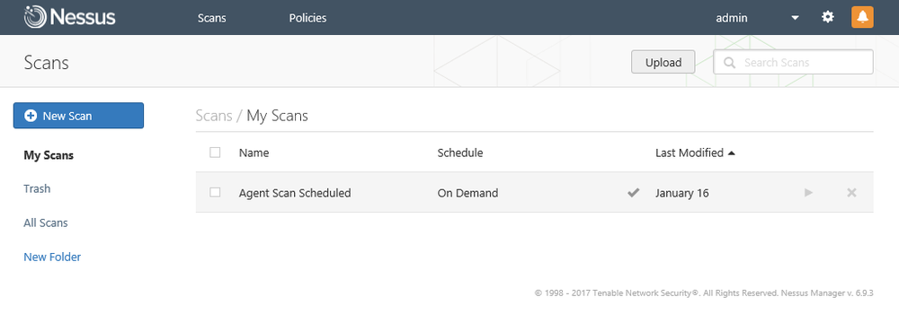

# Intrusive versus Non-intrusive Scanning

#### INTRUSIVE VERSUS NON-INTRUSIVE SCANNING

A network vulnerability scanner can be implemented purely as software or as a security appliance, connected to the network. Some scanners work remotely by contacting the target host over the network. Other scanner types use agents installed locally on each host to perform the scanning and transmit a report to a management server. For example, Nessus Professional allows remote scanning of hosts while Nessus Manager, and Tenable Cloud can work with locally installed agent software.

_Nessus Manager web management interface. (Screenshot used with permission from Tenable Network Security.)_

_Scan intrusiveness_ is a measure of how much the scanner interacts with the target. **Non-intrusive (or passive) scanning** means analyzing indirect evidence, such as the types of traffic generated by a device. A passive scanner, the Zeek Network Security Monitor ([zeek.org](https://course.adinusa.id/sections/intrusive-versus-non-intrusive-scanning)) being one example, analyzes a network capture and tries to identify policy deviations or CVE matches. This type of scanning has the least impact on the network and on hosts, but is less likely to identify vulnerabilities comprehensively. Passive scanning might be used by a threat actor to scan a network stealthily. You might use passive scanning as a technique where active scanning poses a serious risk to system stability, such as scanning print devices, VoIP handsets, or embedded systems networks.

_Active scanning_ means probing the device's configuration using some sort of network connection with the target. Active scanning consumes more network bandwidth and runs the risk of crashing the target of the scan or causing some other sort of outage. Agent-based scanning is also an active technique.

The most intrusive type of vulnerability scanner does not stop at detecting a vulnerability. Exploitation frameworks contain default scripts to try to use a vulnerability to run code or otherwise gain access to the system. This type of highly intrusive testing is more typical of penetration testing than automated vulnerability scanning.