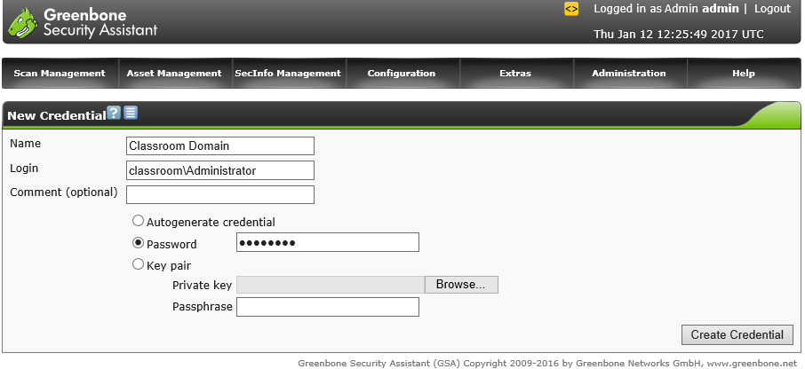

# Credentialed versus Non-Credentialed Scanning

#### CREDENTIALED VERSUS NON-CREDENTIALED SCANNING

A non-credentialed scan is one that proceeds by directing test packets at a host without being able to log on to the OS or application. The view obtained is the one that the host exposes to an unprivileged user on the network. The test routines may be able to include things such as using default passwords for service accounts and device management interfaces, but they are not given privileged access. While you may discover more weaknesses with a credentialed scan, you sometimes will want to narrow your focus to think like an attacker who doesn't have specific high-level permissions or total administrative access. Non-credentialed scanning is often the most appropriate technique for external assessment of the network perimeter or when performing web application scanning.

A credentialed scan is given a user account with logon rights to various hosts, plus whatever other permissions are appropriate for the testing routines. This sort of test allows much more in-depth analysis, especially in detecting when applications or security settings may be misconfigured. It also shows what an insider attack, or one where the attacker has compromised a user account, may be able to achieve. A credentialed scan is a more intrusive type of scan than non-credentialed scanning.

_Configuring credentials for use in target (scope) definitions in Greenbone OpenVAS as installed on Kali Linux. (Screenshot used with permission from Greenbone Networks, [http://www.openvas.org](https://course.adinusa.id/sections/credentialed-versus-non-credentialed-scanning).)_

> _Create dedicated network accounts for use by the vulnerability scanner only. Ensure that the credentials for these accounts are stored securely on the scan server._