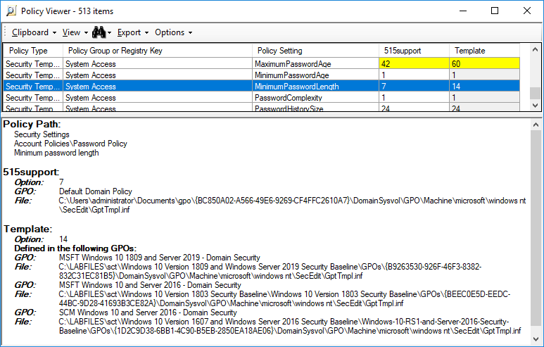

# Configuration Review

#### CONFIGURATION REVIEW

As well as matching known software exploits to the versions of software found running on a network, a vulnerability scan assesses the configuration of security controls and application settings and permissions compared to established benchmarks. It might try to identify whether there is a lack of controls that might be considered necessary or whether there is any misconfiguration of the system that would make the controls less effective or ineffective, such as antivirus software not being updated, or management passwords left configured to the default. Generally speaking, this sort of testing requires a credentialed scan. It also requires specific information about best practices in configuring the particular application or security control. These are provided by listing the controls and appropriate configuration settings in a template.

_Security content automation protocol (SCAP)_ allows compatible scanners to determine whether a computer meets a configuration baseline. SCAP uses several components to accomplish this function, but some of the most important are:

-   Open Vulnerability and Assessment Language (OVAL)—an XML schema for describing system security state and querying vulnerability reports and information.
-   Extensible Configuration Checklist Description Format (XCCDF)—an XML schema for developing and auditing best-practice configuration checklists and rules. Previously, best-practice guides might have been written in prose for system administrators to apply manually. XCCDF provides a machine-readable format that can be applied and validated using compatible software.

_Comparing a local network security policy to a template. The minimum password length set in the local policy is much less than is recommended in the template. (Screenshot used with permission from Microsoft.)_

Some scanners measure systems and configuration settings against best practice frameworks. This is referred to as a compliance scan. This might be necessary for regulatory compliance or you might voluntarily want to conform to externally agreed standards of best practice.

_Scan templates supporting compliance scans in Nessus Manager. (Screenshot used with permission from Tenable Network Security.)_