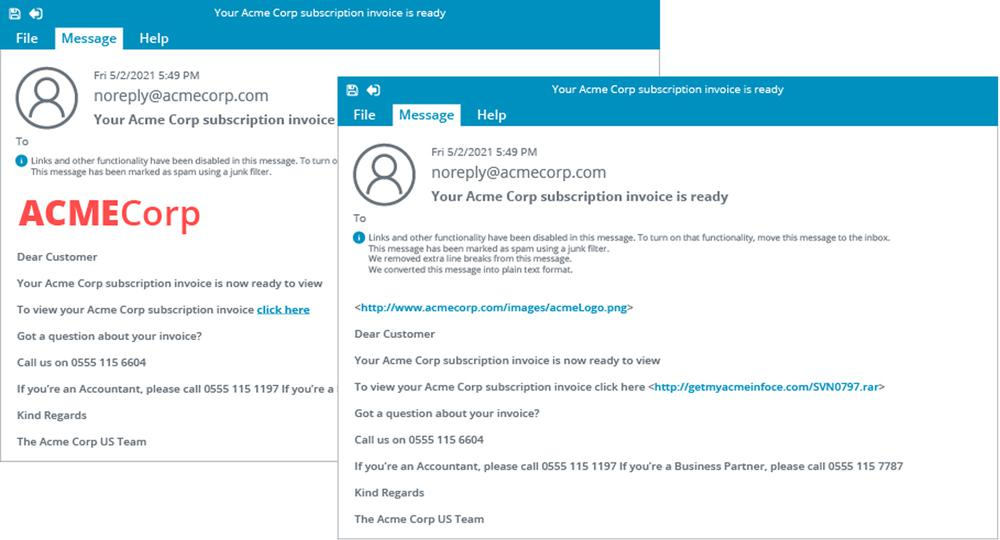

# Phishing, Whaling, and Vishing

#### PHISHING, WHALING, AND VISHING

**Phishing** is a combination of social engineering and spoofing. It persuades or tricks the target into interacting with a malicious resource disguised as a trusted one, traditionally using email as the vector. A phishing message might try to convince the user to perform some action, such as installing disguised malware or allowing a remote access connection by the attacker. Other types of phishing campaign use a spoof website set up to imitate a bank or e‑commerce site or some other web resource that should be trusted by the target. The attacker then emails users of the genuine website informing them that their account must be updated or with some sort of hoax alert or alarm, supplying a disguised link that actually leads to the spoofed site. When the user authenticates with the spoofed site, their logon credentials are captured.

_Example phishing email—On the right, you can see the message in its true form as the mail client has stripped out the formatting (shown on the left) designed to disguise the nature of the links._

There are several phishing variants to be aware of:

-   **Spear phishing**—a phishing scam where the attacker has some information that makes an individual target more likely to be fooled by the attack. Each phishing message is tailored to address a specific target user. The attacker might know the name of a document that the target is editing, for instance, and send a malicious copy, or the phishing email might show that the attacker knows the recipient's full name, job title, telephone number, or other details that help convince the target that the communication is genuine.
    
-   **Whaling**—a spear phishing attack directed specifically against upper levels of management in the organization (CEOs and other "big fish"). Upper management may also be more vulnerable to ordinary phishing attacks because of their reluctance to learn basic security procedures.
    
-   **Vishing**—a phishing attack conducted through a voice channel (telephone or VoIP, for instance). For example, targets could be called by someone purporting to represent their bank asking them to verify a recent credit card transaction and requesting their security details. It can be much more difficult for someone to refuse a request made in a phone call compared to one made in an email.
    

> Rapid improvements in deep fake technology ([forbes.com/sites/jessedamiani/2019/09/03/a-voice-deepfake-was-used-to-scam-a-ceo-out-of-243000](https://course.adinusa.id/sections/phishing-whaling-and-vishing)) are likely to make phishing attempts via voice and even video messaging more prevalent in the future.

-   **SMiShing**—this refers to using short message service (SMS) text communications as the vector.