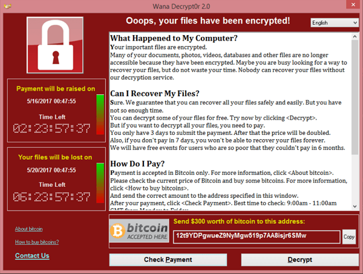

# Ransomware, Crypto-Malware, and Logic Bombs

#### RANSOMWARE, CRYPTO-MALWARE, AND LOGIC BOMBS

**Ransomware** is a type of malware that tries to extort money from the victim. One class of ransomware will display threatening messages, such as requiring Windows to be reactivated or suggesting that the computer has been locked by the police because it was used to view child pornography or for terrorism. This may apparently block access to the file system by installing a different shell program, but this sort of attack is usually relatively simple to fix.

_WannaCry ransomware. (Image by Wikimedia Commons.)_

The crypto-malware class of ransomware attempts to encrypt data files on any fixed, removable, and network drives. If the attack is successful, the user will be unable to access the files without obtaining the private encryption key, which is held by the attacker. If successful, this sort of attack is extremely difficult to mitigate, unless the user has up to date backups of the encrypted files. One example of this is Cryptolocker, a Trojan that searches for files to encrypt and then prompts the victim to pay a sum of money before a certain countdown time, after which the malware destroys the key that allows the decryption.

Ransomware uses payment methods, such as wire transfer, cryptocurrency, or premium rate phone lines, to allow the attacker to extort money without revealing his or her identity or being traced by local law enforcement.

Another type of crypto-malware hijacks the resources of the host to perform cryptocurrency mining. This is referred to as _crypto-mining_ or _cryptojacking_. The total number of coins within a cryptocurrency is limited by the difficulty of performing the calculations necessary to mint a new digital coin. Consequently, new coins can be very valuable, but it takes enormous computing resources to discover them. Cryptojacking is often performed across botnets.

> _The word "crypto" in crypto-malware comes from the word "cryptography" and not from "cryptocurrency"._

Some types of malware do not trigger automatically. Having infected a system, they wait for a pre-configured time or date (time bomb) or a system or user event (**logic bomb**). Logic bombs also need not be malware code. A typical example is a disgruntled system administrator who leaves a scripted trap that runs in the event his or her account is deleted or disabled. Anti-virus software is unlikely to detect this kind of malicious script or program. This type of trap is also referred to as a _mine_.