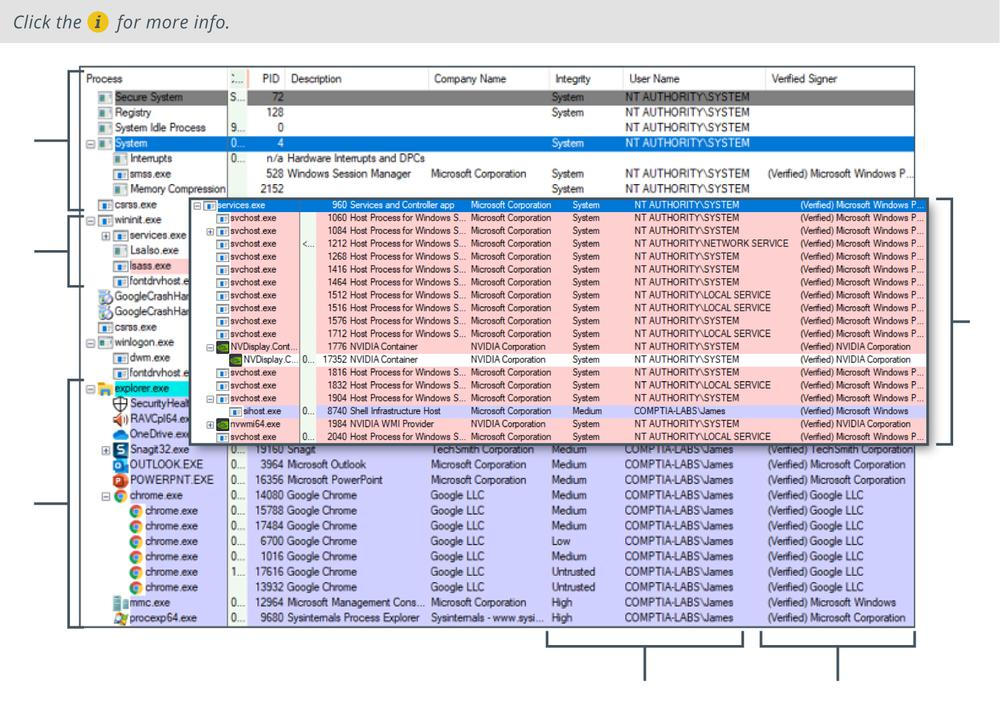

# Malware Indicators

#### MALWARE INDICATORS

Given the range of malware types, there are many potential indicators. Some types of malware display obvious changes, such as adjusting browser settings or displaying ransom notices. If malware is designed to operate covertly, indicators can require detailed analysis of process, file system, and network behavior.

**Antivirus Notifications**  
Most hosts should be running some type of **antivirus (A-V)** software. While the A-V moniker remains popular, these suites are better conceived of as **endpoint protection platforms (EPPs)** or next-gen A-V. These detect malware by signature regardless of type, though detection rates can vary quite widely from product to product. Many suites also integrate with **user and entity behavior analytics (UEBA)** and use AI-backed analysis to detect threat actor behavior that has bypassed malware signature matching.

**Sandbox Execution**  
If it is not detected by endpoint protection, you may want to analyze the suspect code in a sandboxed environment. A **sandbox** is a system configured to be completely isolated from its host so that the malware cannot "break out." The sandbox will be designed to record file system and registry changes plus network activity. **Cuckoo** is packaged software that aims to provide a turnkey sandbox solution ([cuckoosandbox.org](https://course.adinusa.id/sections/malware-indicators)).

**Resource Consumption**  
Abnormal resource consumption can be detected using a performance monitor, Task Manager, or the `top` Linux utility. Indicators such as excessive and continuous CPU usage, memory leaks, disk read/write activity, and disk space usage can be signs of malware, but can also be caused by many other performance and system stability issues. Also, it is only really poorly written malware or malware that performs intensive operations (botnet DDoS, cryptojacking, and cryptoransomware, for instance) that displays this behavior. Resource consumption could be a reason to investigate a system rather than definitive proof of infection.

**File System**  
While fileless malware is certainly prevalent, file system change or **anomaly analysis** is still necessary. Even if the malware code is not saved to disk, the malware is still likely to interact with the file system and registry, revealing its presence by behavior. A computer's file system stores a great deal of useful metadata about when files were created, accessed, or modified. Analyzing these metadata and checking for suspicious temporary files can help you establish your timeline of events for an incident that has left traces on a host and its files.

_Explorer showing regular process hierarchy in Windows 10 v1909. (Screenshot used with permission from Microsoft.)_