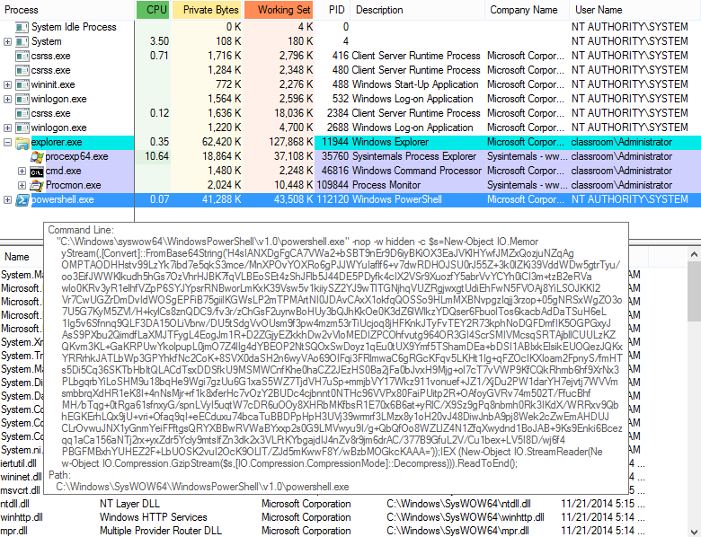

# Process Analysis

#### PROCESS ANALYSIS

Because shellcode is easy to obfuscate, it can often evade signature-based A-V products. Threat hunting and security monitoring must use behavioral-based techniques to identify infections. This means close analysis of the processes running in system memory on a host. To perform **abnormal process behavior** analysis effectively, you should build up a sense of what is "normal" in a system and spot deviations in a potentially infected system. You also need to use appropriate analysis tools. **Sysinternals** ([docs.microsoft.com/en-us/sysinternals](https://course.adinusa.id/sections/process-analysis)) is a suite of tools designed to assist with troubleshooting issues with Windows, and many of the tools are suited to investigating security issues. The Sysinternals tool Process Explorer is an enhanced version of Task Manager. You can view extra information about each process and better understand how processes are created in parent/child relationships.

In this example, the Metasploit Framework is being used to obtain access via a remotely executed PowerShell prompt, with privileges obtained by passing a captured hash. This attack leverages the Sysinternals PsExec utility to drop a service executable into the Admin$ share on the remote machine. In this variant of the attack, the service starts PowerShell. Pointing to the powershell.exe image in Process Explorer shows the parameters that the process launched with. In this case, the command used to start this is not typical of PowerShell usage. There is a long string of characters, which is binary code represented in Base64. The script is injecting this into a new DLL, stored in memory only.

_Observing use of PsExec to invoke a PowerShell script that creates memory-resident shellcode. (Screenshot: Process Explorer docs.microsoft.com/en-us/sysinternals.)_

This sort of behavior can only be observed in real-time when the malware is executed in a sandbox. Threat hunting and automated detection tools can use detailed logging, such as that provided by System Monitor ([github.com/SwiftOnSecurity/sysmon-config](https://course.adinusa.id/sections/process-analysis)), to record and identify malicious process behavior.

Along with observing how a process interacts with the file system, network activity is one of the most reliable ways to identify malware. Threat data can be used to correlate connections to known-bad IP addresses and domains, but malware may try to connect to continually shifting endpoints, utilizing techniques such as fast-flux and domain generation algorithms (DGA). It may try to use social media and cloud services to blend in with legitimate traffic.