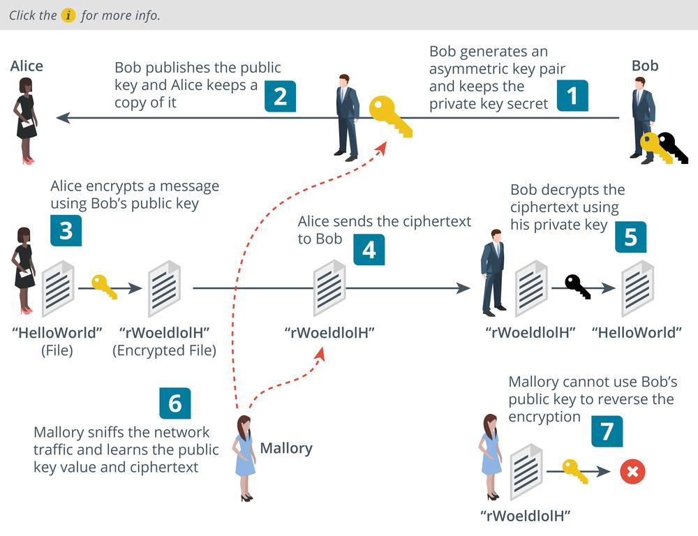

# Asymmetric Encryption

#### ASYMMETRIC ENCRYPTION

In a symmetric encryption cipher, the same secret key is used to perform both encryption and decryption operations. With an asymmetric cipher, operations are performed by two different but related public and **private keys** in a key pair.

Each key is capable of reversing the operation of its pair. For example, if the public key is used to encrypt a message, only the paired private key can decrypt the ciphertext produced. The **public key** cannot be used to decrypt the ciphertext, even though it was used to encrypt it.

The keys are linked in such a way as to make it impossible to derive one from the other. This means that the key holder can distribute the public key to anyone he or she wants to receive secure messages from. No one else can use the public key to decrypt the messages; only the linked private key can do that.

1.  Bob generates a key pair and keeps the private key secret.
    
2.  Bob publishes the public key. Alice wants to send Bob a confidential message, so she takes a copy of Bob's public key.
    
3.  Alice uses Bob's public key to encrypt the message.
    
4.  Alice sends the ciphertext to Bob.
    
5.  Bob receives the message and is able to decrypt it using his private key.
    
6.  If Mallory has been snooping, he can intercept both the message and the public key.
    
7.  However, Mallory cannot use the public key to decrypt the message, so the system remains secure.

_Asymmetric encryption. (Images © 123RF.com.)_

Asymmetric encryption can be used to prove identity. The holder of a private key cannot be impersonated by anyone else. The drawback of asymmetric encryption is that it involves substantial computing overhead compared to symmetric encryption. The message cannot be larger than the key size. Where a large amount of data is being encrypted on disk or transported over a network, asymmetric encryption is inefficient.

Consequently, asymmetric encryption is mostly used for authentication and non-repudiation and for key agreement and exchange. Key agreement/exchange refers to settling on a secret symmetric key to use for bulk encryption without anyone else discovering it.