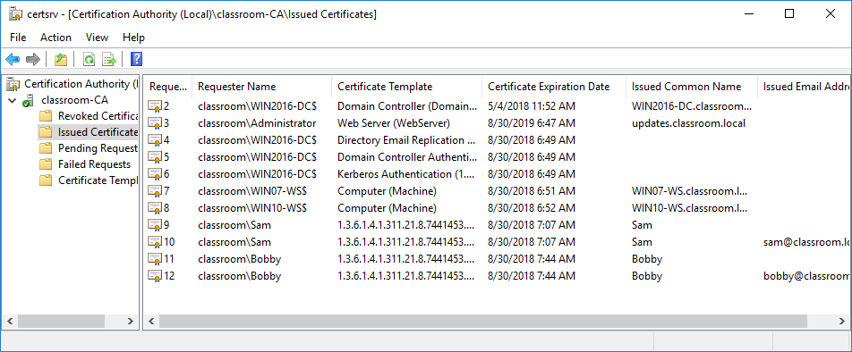

# Certificate Authorities

#### CERTIFICATE AUTHORITIES

The **certificate authority (CA)** is the entity responsible for issuing and guaranteeing certificates. Private CAs can be set up within an organization for internal communications. Most network operating systems, including Windows Server, have certificate services. For public or business-to-business communications, however, the CA must be trusted by each party. Third-party CA services include IdenTrust, Digicert, Sectigo/Comodo, GoDaddy, and GlobalSign. The functions of a CA are as follows:

-   Provide a range of certificate services useful to the community of users serviced by the CA.
    
-   Ensure the validity of certificates and the identity of those applying for them (registration).
    
-   Establish trust in the CA by users and government and regulatory authorities and enterprises, such as financial institutions.
    
-   Manage the servers (repositories) that store and administer the certificates.
    
-   Perform key and certificate lifecycle management, notably revoking invalid certificates.

_Microsoft Windows Server CA. (Screenshot used with permission from Microsoft.)_