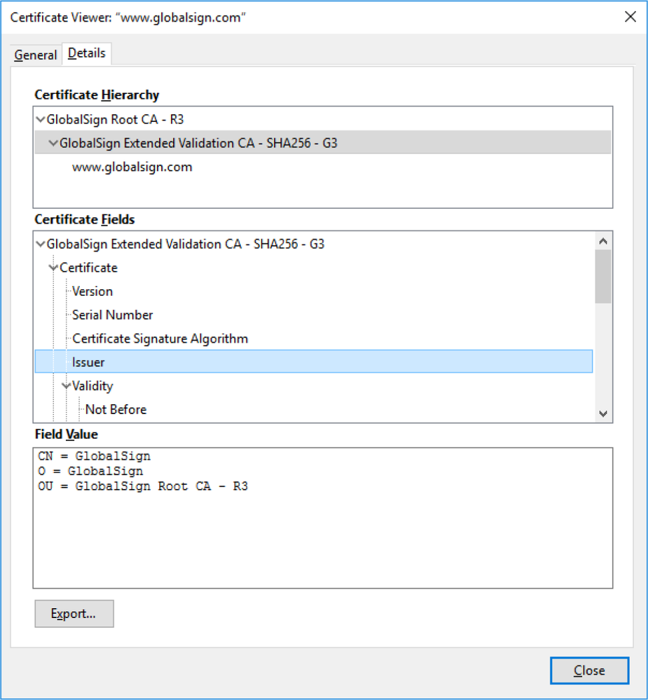

# PKI Trust Models

#### PKI TRUST MODELS

The _trust model_ is a critical PKI concept, and shows how users and different CAs are able to trust one another.

**Single CA**  
In this simple model, a single CA issues certificates to users; users trust certificates issued by that CA and no other. The problem with this approach is that the single CA server is very exposed. If it is compromised, the whole PKI collapses.

**Hierarchical (Intermediate CA)**  
In the hierarchical model, a single CA (called the _root_) issues certificates to several intermediate CAs. The intermediate CAs issue certificates to subjects (leaf or end entities). This model has the advantage that different intermediate CAs can be set up with different certificate policies, enabling users to perceive clearly what a particular certificate is designed for. Each leaf certificate can be traced back to the root CA along the certification path. This is also referred to as **certificate chaining**, or a _chain of trust_. The root's certificate is self-signed. In the hierarchical model, the root is still a single point of failure. If the root is damaged or compromised, the whole structure collapses. To mitigate against this, however, the root server can be taken offline, as most of the regular CA activities are handled by the intermediate CA servers.

_A certification path. The leaf certificate ([www.globalsign.com](https://course.adinusa.id/sections/pki-trust-models)) was issued by an intermediate Extended Validation CA, and that CA's certificate was issued by the root CA. (Screenshot used with permission from Microsoft.)_

Another problem is that there is limited opportunity for cross-certification; that is, to trust the CA of another organization. Two organizations could agree to share a root CA, but this would lead to operational difficulties that could only increase as more organizations join. In practice, most clients are configured to trust multiple root CAs.

**Online versus Offline CAs**  
An **online CA** is one that is available to accept and process certificate signing requests, publish certificate revocation lists, and perform other certificate management tasks. Because of the high risk posed by compromising the root CA, a secure configuration involves making the root an **offline CA**. This means that it is disconnected from any network and usually kept in a powered-down state. The root CA will need to be brought online to add or update intermediate CAs.