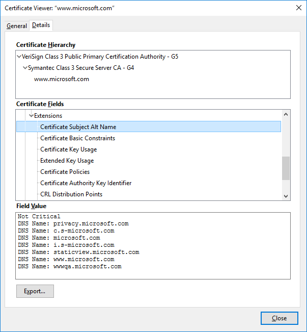
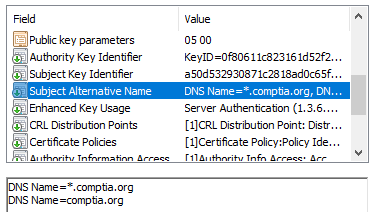

# Subject Name Attributes

#### SUBJECT NAME ATTRIBUTES

When certificates were first introduced, the **common name** (CN) attribute was used to identify the FQDN by which the server is accessed, such as `www.comptia.org`. This usage grew by custom rather than design, however. The CN attribute can contain different kinds of information, making it difficult for a browser to interpret it correctly. Consequently, the CN attribute is deprecated as a method of validating subject identity ([tools.ietf.org/html/rfc2818#section-3.1](https://course.adinusa.id/sections/subject-name-attributes)).

The **subject alternative name (SAN)** extension field is structured to represent different types of identifiers, including domain names. If a certificate is configured with a SAN, the browser should validate that, and ignore the CN value. It is still safer to put the FQDN in the CN as well, because not all browsers and implementations stay up-to-date with the standards.

The SAN field also allows a certificate to represent different subdomains, such as `www.comptia.org` and `members.comptia.org`.

_Microsoft's website certificate configured with alternative subject names for different subdomains. (Screenshot used with permission from Microsoft.)_

Listing the specific subdomains is more secure, but if a new subdomain is added, a new certificate must be issued. A wildcard domain, such as `*.comptia.org`, means that the certificate issued to the parent domain will be accepted as valid for all subdomains (to a single level).

_CompTIA's website certificate configured with a wildcard domain, allowing access via either https://comptia.org or https://www.comptia.org. (Screenshot used with permission from Microsoft.)_