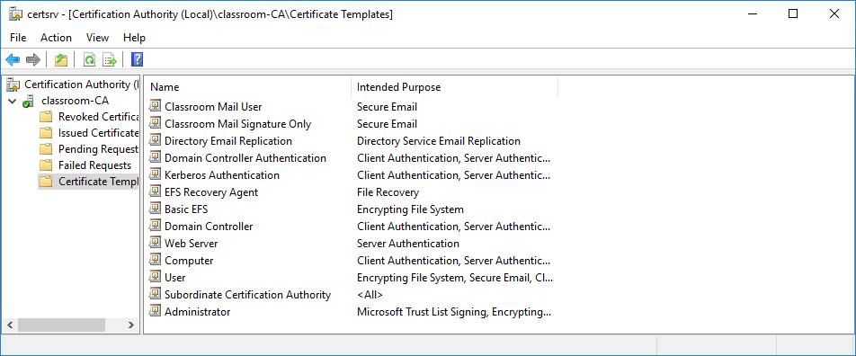

# Types of Certificate

#### TYPES OF CERTIFICATE

**Certificate policies** define the different uses of certificate types issued by the CA. These can be configured as standard certificate templates.

A certificate type is set by configuring the the Key Usage attribute. The Extended Key Usage (EKU) field—referred to by Microsoft as _Enhanced Key Usage_—is a complementary means of defining usage. Typical values used include Server Authentication, Client Authentication, Code Signing, or Email Protection. The EKU field is more flexible than the Key Usage field, but problems can occur when nonstandard or vendor-specific definitions are used.

An extension can be tagged as _critical_, meaning that the application processing the certificate must be able to interpret the extension correctly; otherwise, the certificate should be rejected. In the case of a Key Usage extension marked as critical, an application should reject the certificate if it cannot resolve the Key Usage value. For example, this prevents a certificate issued for encrypting traffic sent to a web server from being used for signing an email message.

_Certificate templates for Windows Server CA. (Screenshot used with permission from Microsoft.)_