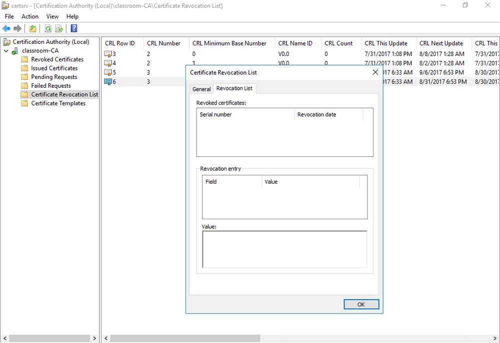

# Certificate Revocation Lists

#### CERTIFICATE REVOCATION LISTS

A certificate may be revoked or suspended:

-   A revoked certificate is no longer valid and cannot be "un-revoked" or reinstated.
    
-   A suspended certificate can be re-enabled.
    

A certificate may be revoked or suspended by the owner or by the CA for many reasons. For example, the certificate or its private key may have been compromised, the business could have closed, a user could have left the company, a domain name could have been changed, the certificate could have been misused in some way, and so on. These reasons are codified under choices such as Unspecified, Key Compromise, CA Compromise, Superseded, or Cessation of Operation. A suspended key is given the code Certificate Hold.

It follows that there must be some mechanism for informing users whether a certificate is valid, revoked, or suspended. CAs must maintain a **certificate revocation list (CRL)** of all revoked and suspended certificates, which can be distributed throughout the hierarchy.

_CRLs published by Windows Certificate Services—The current CRL contains one revoked certificate. (Screenshot used with permission from Microsoft.)_

With the CRL system, there is a risk that the certificate might be revoked but still accepted by clients because an up-to-date CRL has not been published. A further problem is that the browser (or other application) may not be configured to perform CRL checking, although this now tends to be the case only with legacy browser software.