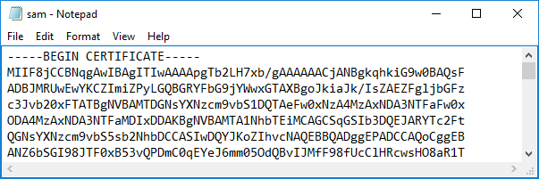

# Certificate Formats

#### CERTIFICATE FORMATS

There are various formats for encoding a certificate as a digital file for exchange between different systems.

**Encoding**  
Cryptographic data—both certificates and keys—are processed as binary using **Distinguished Encoding Rules (DER)**. Binary format files are not commonly used, however.

More typically, the binary data is represented as **ASCII** text characters using Base64 **Privacy-enhanced Electronic Mail (PEM)** encoding. ASCII-format data has descriptive headers, such as the "BEGIN CERTIFICATE" string.

_Base64-encoded .CER file opened in Notepad. (Screenshot used with permission from Microsoft.)_

**File Extensions**  
A three character file extension is a _convention_, not a standard, and unfortunately file extensions do not always map cleanly to the type of encoding used within a certificate file, or even to the contents of a certificate file. The only certain way to check is to open it in a text editor.

-   Both .DER and .PEM can be used as file extensions, although the latter is not recognized by Windows. .PEM is the the most widely used extension for ASCII format files in Linux.
    
-   The .CRT and .CER extensions can also be used, but they they are not well-standardized. Most of the confusion arises from the way Windows handles certificates. In Linux, .CRT is most likely to represent an ASCII certificate. In Windows, the most common extension is .CER, but this does not tell you whether the file format is binary or ASCII.
    

**Contents**  
A certificate file can also contain more than just a single certificate:

-   The **PKCS #12 format** allows the export of the private key with the certificate. This would be used either to transfer a private key to a host that could not generate its own keys, or to back up/archive a private key. This type of file format is usually password-protected and always binary. On Windows, these usually have a **.PFX** extension, while MacOS and iOS use .P12. In Linux, the certificate and key are usually stored in separate files.
    
-   The **P7B format** implements PKCS #7, which is a means of bundling multiple certificates in the same file. It is typically in ASCII format. This is most often used to deliver a chain of certificates that must be trusted by the processing host. It is associated with the use of S/MIME to encrypt email messages. P7B files do not contain the private key. In Linux, the .PEM extension is very widely used for certificate chains.