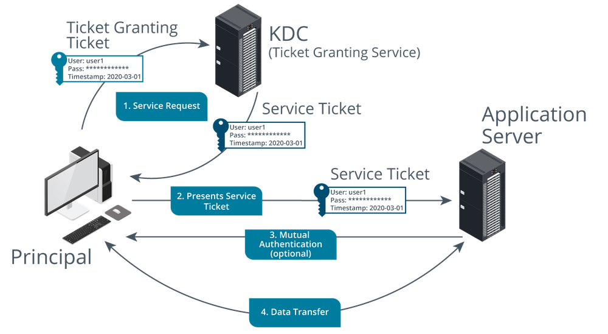

# Kerberos Authorization

#### KERBEROS AUTHORIZATION

Presuming the user entered the correct password, the client can decrypt the Ticket Granting Service (TGS) session key but not the TGT. This establishes that the client and KDC know the same shared secret and that the client cannot interfere with the TGT.

1.  To access resources within the domain, the client requests a Service Ticket (a token that grants access to a target application server). This process of granting service tickets is handled by the TGS.
2.  The client sends the TGS a copy of its TGT and the name of the application server it wishes to access plus an authenticator, consisting of a time-stamped client ID encrypted using the TGS session key.

The TGS should be able to decrypt both messages using the KDC's secret key for the first and the TGS session key for the second. This confirms that the request is genuine. It also checks that the ticket has not expired and has not been used before (replay attack).

3.  The TGS service responds with:

-   Service session key—for use between the client and the application server. This is encrypted with the TGS session key.
-   Service ticket—containing information about the user, such as a timestamp, system IP address, Security Identifier (SID) and the SIDs of groups to which he or she belongs, and the service session key. This is encrypted using the application server's secret key.

_Kerberos Ticket Granting Service. (Images © 123RF.com.)_

4.  The client forwards the service ticket, which it cannot decrypt, to the application server and adds another time-stamped authenticator, which is encrypted using the service session key.
5.  The application server decrypts the service ticket to obtain the service session key using its secret key, confirming that the client has sent it an untampered message. It then decrypts the authenticator using the service session key.
6.  Optionally, the application server responds to the client with the timestamp used in the authenticator, which is encrypted by using the service session key. The client decrypts the timestamp and verifies that it matches the value already sent, and concludes that the application server is trustworthy.

This means that the server is authenticated to the client (referred to as _mutual authentication_). This prevents a man-in-the-middle attack, where a malicious user could intercept communications between the client and server.

7.  The server now responds to client requests (assuming they conform to the server's access control list).

> The data transfer itself is not encrypted (at least as part of Kerberos; some sort of transport encryption can be deployed).

One of the noted drawbacks of Kerberos is that the KDC represents a single point-of-failure for the network. In practice, backup KDC servers can be implemented (for example, Active Directory supports multiple domain controllers, each of which are running the KDC service).