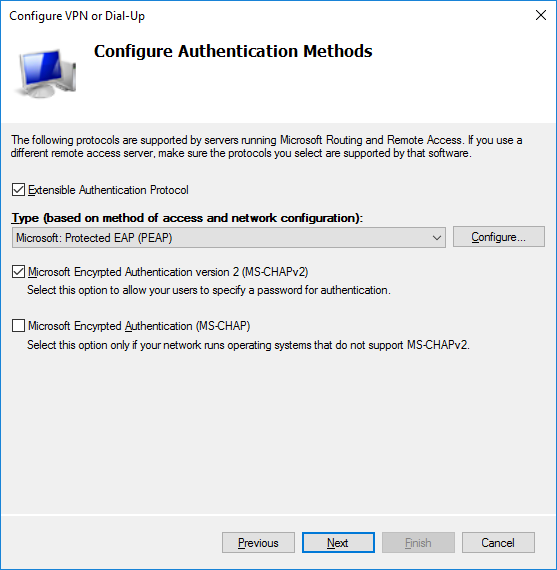

# PAP, CHAP, and MS-CHAP Authentication

#### PAP, CHAP, AND MS-CHAP AUTHENTICATION

Kerberos is designed to work over a trusted local network. Several authentication protocols have been developed to work with remote access protocols, where the connection is made over a serial link or virtual private network (VPN).

**Password Authentication Protocol (PAP)**  
The **Password Authentication Protocol (PAP)** is an unsophisticated authentication method developed as part of the Point-to-Point Protocol (PPP), used to transfer TCP/IP data over serial or dial-up connections. It is also used as the basic authentication mechanism in HTTP. It relies on clear text password exchange and is therefore obsolete for most purposes, except through an encrypted tunnel.

**Challenge Handshake Authentication Protocol (CHAP)**  
The **Challenge Handshake Authentication Protocol (CHAP)** was also developed as part of PPP as a means of authenticating users over a remote link. CHAP relies on an encrypted challenge in a system called a _three-way handshake_.

1.  Challenge—the server challenges the client, sending a randomly generated challenge message.
    
2.  Response—the client responds with a hash calculated from the server challenge message and client password (or other shared secret).
    
3.  Verification—the server performs its own hash using the password hash stored for the client. If it matches the response, then access is granted; otherwise, the connection is dropped.
    

The handshake is repeated with a different challenge message periodically during the connection (although transparent to the user). This guards against _replay attacks_, in which a previous session could be captured and reused to gain access.

**MS-CHAPv2** is Microsoft's implementation of CHAP. Because of the way it uses vulnerable NTLM hashes, MS-CHAP should not be deployed without the protection of a secure connection tunnel so that the credentials being passed are encrypted.

_Defining allowed authentication mechanisms on a Windows VPN. (Screenshot used with permission from Microsoft.)_