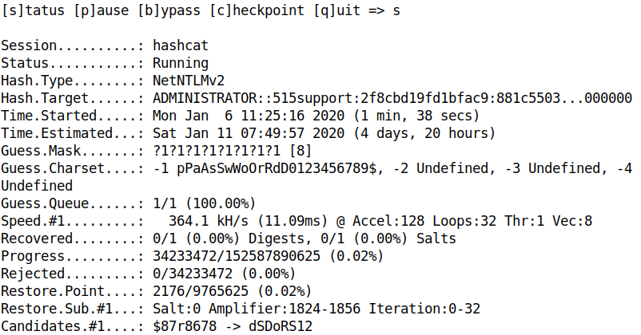

# Password Crackers

#### PASSWORD CRACKERS

Although there are some Windows tools, including the infamous Cain and L0phtcrack ([l0phtcrack.com](https://course.adinusa.id/sections/password-crackers)) tools, most **password crackers** run primarily on Linux. For example, a tool such as **Hashcat** ([hashcat.net/hashcat](https://course.adinusa.id/sections/password-crackers)) is run using the following general syntax:

`hashcat -m HashType -a AttackMode -o OutputFile InputHashFile`

The input file should contain hashes of the same type, using the specified format ([hashcat.net/wiki/doku.php?id=example\_hashes](https://course.adinusa.id/sections/password-crackers)). Hashcat can be used with a single word list (dictionary mode `-a 0`) or multiple word lists (combinator mode `-a 1`). Mode `-a 3` performs a brute-force attack, but this can be combined with a mask for each character position. This reduces the key space that must be searched and speeds up the attack. For example, you might learn or intuit that a company uses only letter characters in passwords. By omitting numeric and symbol characters, you can speed up the attack on each hash.

_Running a masked brute-force attack—this example is running on a VM, so the recovery rate is very low. (Screenshot hashcat [hashcat.net/hashcat](https://course.adinusa.id/sections/password-crackers).)_