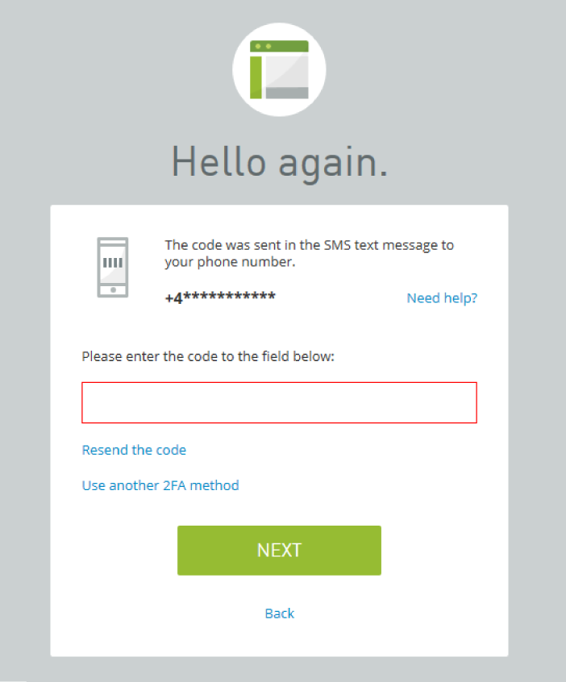

# Open Authentication

#### OPEN AUTHENTICATION

The **Initiative for Open Authentication (OATH)** is an industry body established with the aim of developing an open, strong authentication framework. _Open_ means a system that any enterprise can link into to perform authentication of users and devices across different networks. _Strong_ means that the system is based not just on passwords, but also on 2- or 3-factor authentication or on 2-step verification. OATH has developed two algorithms for implementing one time passwords (OTPs).

**HMAC-Based One-Time Password Algorithm (HOTP)**  
**HMAC-based One-time Password Algorithm (HOTP)** is an algorithm for token-based authentication ([tools.ietf.org/html/rfc4226](https://course.adinusa.id/sections/open-authentication)). The authentication server and client token are configured with the same shared secret. This should be an 8-byte value generated by a cryptographically strong random number generator. The token could be a fob-type device or implemented as a smartphone authentication/authenticator app. The shared secret can be transmitted to the smartphone app as a QR code image acquirable by the phone's camera so that the user doesn't have to type anything. Obviously, it is important that no other device is able to acquire the shared secret. The shared secret is combined with a counter to create a one-time password when the user wants to authenticate. The device and server both compute the hash and derive an HOTP value that is 6-8 digits long. This is the value that the user must enter to authenticate with the server. The counter is incremented by one.

> _The server is configured with a counter window to cope with the circumstance that the device and server counters move out of sync. This could happen if the user generates an OTP but does not use it, for instance._

**Time-Based One-Time Password Algorithm (TOTP)**  
The **Time-based One-time Password Algorithm (TOTP)** is a refinement of the HOTP ([tools.ietf.org/html/rfc6238](https://course.adinusa.id/sections/open-authentication)). One issue with HOTP is that tokens can be allowed to persist unexpired, raising the risk that an attacker might be able to obtain one and decrypt data in the future. In TOTP, the HMAC is built from the shared secret plus a value derived from the device's and server's local timestamps. TOTP automatically expires each token after a short window (60 seconds, for instance). For this to work, the client device and server must be closely time-synchronized. One well-known implementation of HOTP and TOTP is Google Authenticator.

_Two-step verification mechanism protecting web application access. The site sends a Time-based One Time Password with a duration of five minutes to the registered cell phone by SMS._

> _Don’t confuse OATH (Open Authentication) with OAuth (Open Authorization)._