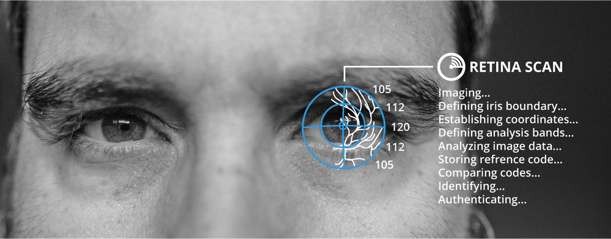

# Facial Recognition

#### FACIAL RECOGNITION

Facial recognition records multiple indicators about the size and shape of the face, like the distance between each eye, or the width and length of the nose. The initial pattern must be recorded under optimum lighting conditions; depending on the technology, this can be a lengthy process. Again, this technology is very much associated with law enforcement, and is the most likely to make users uncomfortable about the personal privacy issues. Facial recognition suffers from relatively high false acceptance and rejection rates and can be vulnerable to spoofing. Much of the technology development is in surveillance, rather than for authentication, although it is becoming a popular method for use with smartphones.

The limitations of facial recognition can be overcome by scanning more detailed features of the eye:

-   Retinal scan—an infrared light is shone into the eye to identify the pattern of blood vessels. The arrangement of these blood vessels is highly complex and typically does not change from birth to death, except in the event of certain diseases or injuries. Retinal scanning is therefore one of the most accurate forms of biometrics. Retinal patterns are very secure, but the equipment required is expensive and the process is relatively intrusive and complex. False negatives can be produced by disease, such as cataracts.

_A retinal scan uses an infrared light to identify the pattern of blood vessels in the eye. (Photo by Ghost Presenter on Unsplash.)_

-   Iris scan—matches patterns on the surface of the eye using near-infrared imaging and so is less intrusive than retinal scanning (the subject can continue to wear glasses, for instance) and a lot quicker. Iris scanners offer a similar level of accuracy as retinal scanners but are much less likely to be affected by diseases. Iris scanning is the technology most likely to be rolled out for high-volume applications, such as airport security. There is a chance that an iris scanner could be fooled by a high-resolution photo of someone's eye.