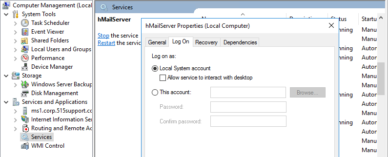

# Service Accounts

#### SERVICE ACCOUNTS

**Service accounts** are used by scheduled processes and application server software, such as databases. Windows has several default service account types. These do not accept user interactive logons but can be used to run processes and background services:

-   System—has the most privileges of any Windows account. The local system account creates the host processes that start Windows before the user logs on. Any process created using the system account will have full privileges over the local computer.
    
-   Local Service—has the same privileges as the standard user account. It can only access network resources as an anonymous user.
    
-   Network Service—has the same privileges as the standard user account but can present the computer's account credentials when accessing network resources.

_Configuring the credentials for a service running on Windows Server. This service is using the local system account. This account has full local administrator privileges. (Screenshot used with permission from Microsoft.)_

Linux also uses the concept of service accounts to run non-interactive daemon processes, such as web servers and databases. These accounts are usually created by the server application package manager. Users can be prevented from logging into these accounts (often by setting the password to an unknown value and denying shell access).

If a named account is manually configured to run a service, the password for the service account will effectively be shared by multiple administrators. Many operating systems support automatic provisioning of credentials for service accounts, reducing the risk of insider threat ([techcommunity.microsoft.com/t5/ask-the-directory-services-team/managed-service-accounts-understanding-implementing-best/ba-p/397009](https://course.adinusa.id/sections/service-accounts)).

> _Be aware of the risk of using a personal account when a service account is appropriate. If you use a personal account and the user changes the password or the account is disabled for some reason, then the service will fail to run, which can cause serious problems with business applications._