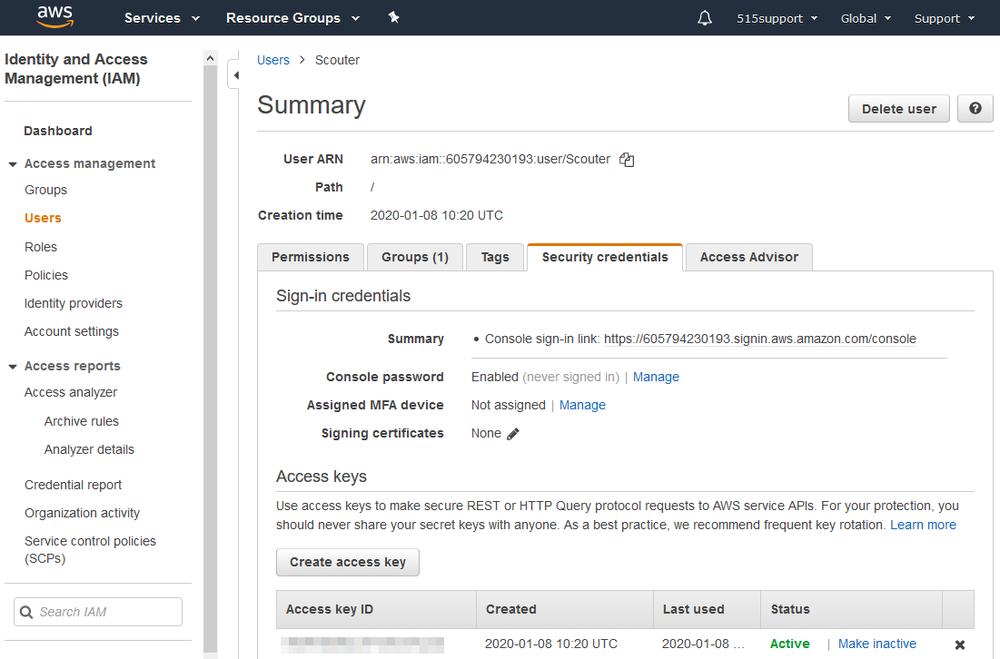

# Secure Shell Keys and Third-party Credentials

#### SECURE SHELL KEYS AND THIRD-PARTY CREDENTIALS

Secure Shell (SSH) is a widely used remote access protocol. It is very likely to be used to manage devices and services. SSH uses two types of key pairs:

-   A host key pair identifies an SSH server. The server reveals the public part when a client connects to it. The client must use some means of determining the validity of this public key. If accepted, the key pair is used to encrypt the network connection and start a session.
    
-   A user key pair is a means for a client to login to an SSH server. The server stores a copy of the client's public key. The client uses the linked private key to generate an authentication request and sends the request (not the private key) to the server. The server can only validate this request if the correct public key is held for that client.
    

SSH keys have often not been managed very well, leading to numerous security breaches, most infamously the Sony hack ([ssh.com/malware](https://course.adinusa.id/sections/secure-shell-keys-and-third-party-credentials)). There are vendor solutions for SSH key management or you can configure servers and clients to use public key infrastructure (PKI) and certificate authorities (CAs) to validate identities.

A third-party credential is one used by your company to manage a vendor service or cloud app. As well as administrative logons, devices and services may be configured with a password or cryptographic keys to access hosts via SSH or **via an application programming interface (API)**. Improper management of these secrets, such as including them in code or scripts as plaintext, has been the cause of many breaches ([nakedsecurity.sophos.com/2019/03/25/thousands-of-coders-are-leaving-their-crown-jewels-exposed-on-github](https://course.adinusa.id/sections/secure-shell-keys-and-third-party-credentials)).

_Security credentials for an account on Amazon Web Services (AWS). The user can authenticate with a password credential, or use an access key within a script. The access key is stored only on the user's client device and cannot be retrieved via the console. It can be disabled or deleted, however. (Screenshot courtesy of Amazon.com)_