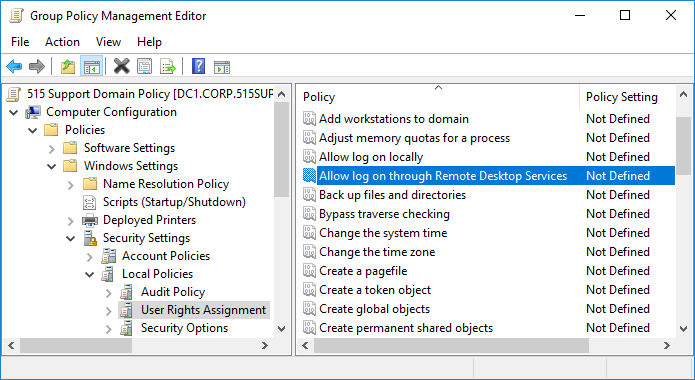

# Account Attributes and Access Policies

#### ACCOUNT ATTRIBUTES AND ACCESS POLICIES

As well as authenticating the user, an account can be configured with attributes as a user profile. Account objects can also be used to assign permissions and access policies.

**Account Attributes**  
A user account is defined by a unique **security identifier (SID)**, a name, and a credential. Each account is associated with a profile. The profile can be defined with custom identity attributes describing the user, such as a full name, email address, contact number, department, and so on. The profile may support media, such as an account picture.

As well as attributes, the profile will usually provide a location for storing user-generated data files (a home folder). The profile can also store per-account settings for software applications.

**Access Policies**  
Each account can be assigned permissions over files and other network resources and access policies or privileges over the use and configuration of network hosts. These permissions might be assigned directly to the account or inherited through membership of a security group or role. Access policies determine things like the right to log on to a computer locally or via remote desktop, install software, change the network configuration, and so on.

On a Windows Active Directory network, access policies can be configured via **group policy objects (GPOs)**. GPOs can be used to configure access rights for user/group/role accounts. GPOs can be linked to network administrative boundaries in Active Directory, such as sites, domains, and Organizational Units (OU).

_Configuring access policies and rights using Group Policy Objects in Windows Server 2016. (Screenshot used with permission from Microsoft.)_