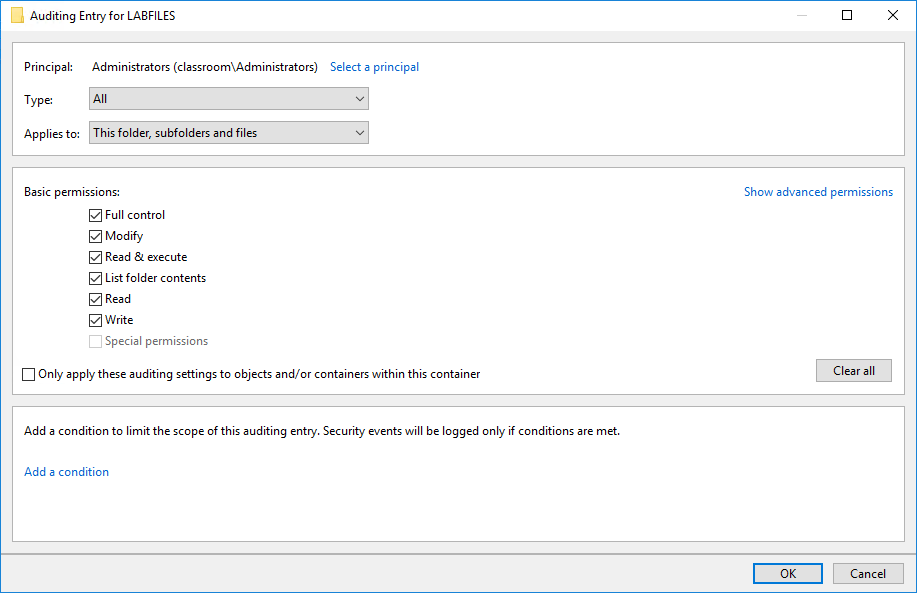

# Usage Audits

#### USAGE AUDITS

Usage auditing means configuring the security log to record key indicators and then reviewing the logs for suspicious activity. Determining what to log is one of the most considerable challenges a network administrator can face. For Active Directory, Microsoft has published audit policy recommendations for baseline requirements and networks with stronger security requirements ([docs.microsoft.com/en-us/windows-server/identity/ad-ds/plan/security-best-practices/audit-policy-recommendations](https://course.adinusa.id/sections/usage-audits)). Some typical categories include:

-   Account logon and management events.
    
-   Process creation.
    
-   Object access (file system/file shares).
    
-   Changes to audit policy.
    
-   Changes to system security and integrity (antivirus, host firewall, and so on).

_Configuring audit entries for a folder in Windows. (Screenshot used with permission from Microsoft.)_