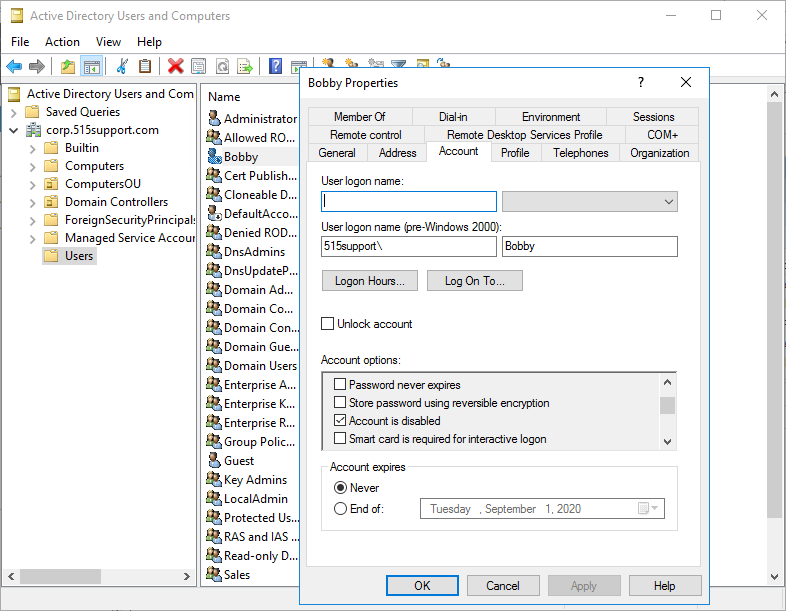
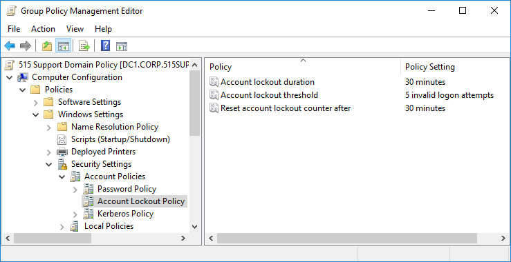

# Account Lockout and Disablement

#### ACCOUNT LOCKOUT AND DISABLEMENT

If account misuse is detected or suspected, the account can be manually disabled by setting an account property. This prevents the account from being used for login. Note that disabling the account does not close existing sessions. You can issue a remote logoff command to close a session. Account disablement means that login is permanently prevented until an administrator manually re-enables the account.

_Setting a property to disable an account. (Screenshot used with permission from Microsoft.)_

An account lockout means that login is prevented for a period. This might be done manually if a policy violation is detected, but there are several scenarios for automatically applying a lockout:

-   An incorrect account password is entered repeatedly.
    
-   The account is set to expire. Setting an **account expiration** date means that an account cannot be used beyond a certain date. This option is useful on accounts for temporary and contract staff.
    
-   When using time- or location-based restrictions, the server periodically checks whether the user has the right to continue using the network. If the user does not have the right, then an automatic logout procedure commences.

_Configuring an account lockout policy. (Screenshot used with permission from Microsoft.)_