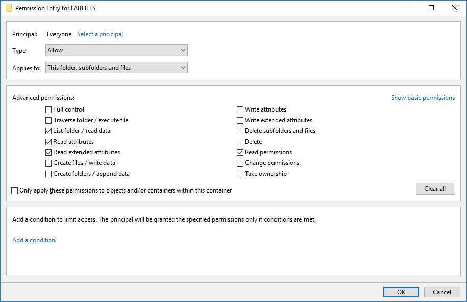

# File System Permissions

#### FILE SYSTEM PERMISSIONS

An access control model can be applied to any type of data or software resource but is most closely associated with network, file system, and database security. With file system security, each object in the file system has an ACL associated with it. The ACL contains a list of accounts (principals) allowed to access the resource and the permissions they have over it. Each record in the ACL is called an access control entry (ACE). The order of ACEs in the ACL is important in determining effective permissions for a given account. ACLs can be enforced by a file system that supports permissions, such as NTFS, ext3/ext4, or ZFS.

_Configuring an access control entry for a folder. (Screenshot used with permission from Microsoft.)_

For example, in Linux, there are three basic permissions:

-   Read (`r`)—the ability to access and view the contents of a file or list the contents of a directory.
    
-   Write (`w`)—the ability to save changes to a file, or create, rename, and delete files in a directory (also requires execute).
    
-   Execute (`x`)—the ability to run a script, program, or other software file, or the ability to access a directory, execute a file from that directory, or perform a task on that directory, such as file search.
    

These permissions can be applied in the context of the owner user (`u`), a group account (`g`), and all other users/world (`o`). A permission string lists the permissions granted in each of these contexts:

`d rwx r-x r-x home`

The string above shows that for the directory (`d`), the owner has read, write, and execute permissions, while the group context and other users have read and execute permissions.

The **chmod** command is used to modify permissions. It can be used in symbolic mode or absolute mode. In symbolic mode, the command works as follows:

`chmod g+w, o-x home`

The effect of this command is to append write permission to the group context and remove execute permission from the other context. By contrast, the command can also be used to replace existing permissions. For example, the following command applies the configuration shown in the first permission string:

`chmod u=rwx,g=rx,o=rx home`

In absolute mode, permissions are assigned using octal notation, where r=4, w=2, and x=1. For example, the following command has the same effect:

`chmod 755 home`