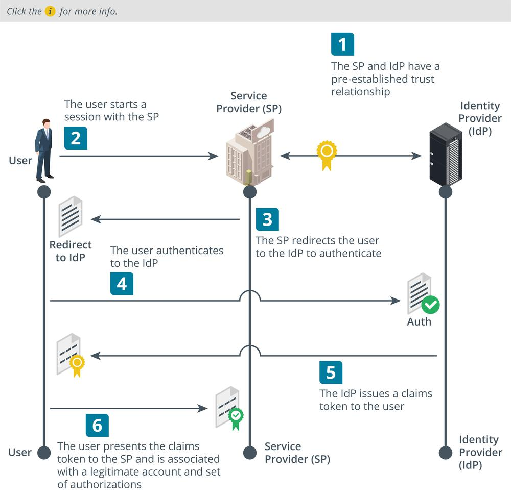

# Federation and Attestation

#### FEDERATION AND ATTESTATION

An on-premises network can use technologies such as LDAP and Keberos, very often implemented as a Windows Active Directory network, because the administration of accounts and devices can be centralized. Expanding this type of network to share resources with business partners or use services in public clouds means implementing some type of federation technology.

**Federation** **Federation** is the notion that a network needs to be accessible to more than just a well-defined group of employees. In business, a company might need to make parts of its network open to partners, suppliers, and customers. The company can manage its employee accounts easily enough. Managing accounts for each supplier or customer internally may be more difficult. Federation means that the company trusts accounts created and managed by a different network. As another example, in the consumer world, a user might want to use both Google Apps and Twitter. If Google and Twitter establish a federated network for the purpose of authentication and authorization, then the user can log on to Twitter using his or her Google credentials or vice versa.

**Identity Providers and Attestation**  
In these models, the networks perform federated identity management. A user from one network is able to provide attestation that proves their identity. In very general terms, the process is similar to that of Kerberos authorization, and works as follows:

1.  The user (principal) attempts to access a service provider (SP), or the relying party (RP). The service provider redirects the principal to the identity provider (IdP) to authenticate.
    
2.  The principal authenticates with the identity provider and obtains an attestation of identity, in the form of some sort of token or document signed by the IdP.
    
3.  The principal presents the attestation to the service provider. The SP can validate that the IdP has signed the attestation because of its trust relationship with the IdP.
    
4.  The service provider can now connect the authenticated principal to its own accounts database. It may be able to query attributes of the user account profile held by the IdP, if the principal has authorized this type of access.

_Federated identity management overview. (Images © 123RF.com.)_

**Cloud versus On-Premises Requirements**  
Where a company needs to make use of cloud services or share resources with business partner networks, authentication and authorization design comes with more constraints and additional requirements. Web applications might not support Kerberos, while third-party networks might not support direct federation with Active Directory/LDAP. The design for these cloud networks is likely to require the use of standards for performing federation and attestation between web applications.