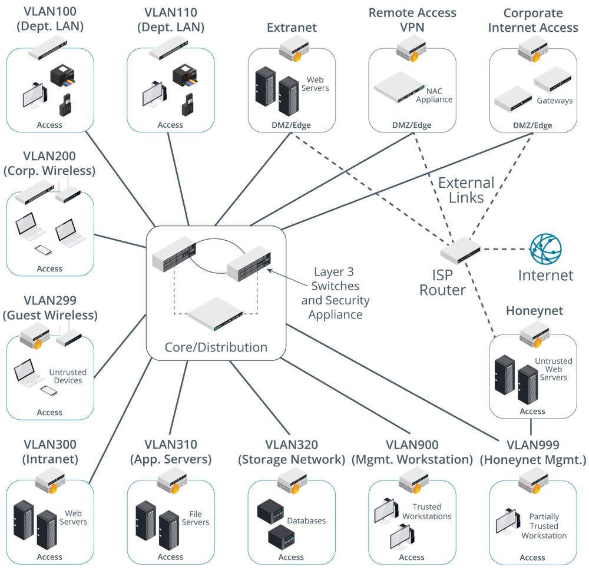

# Network Topology and Zones

#### NETWORK TOPOLOGY AND ZONES

Given the ability to create segregated segments with the network, you can begin to define a topology of different network zones. A topology is a description of how a computer network is physically or logically organized. The logical and physical network topology should be analyzed to identify points of vulnerability and to ensure that the goals of confidentiality, integrity, and availability are met by the design.

The main building block of a security topology is the zone. A **zone** is an area of the network where the security configuration is the same for all hosts within it. Zones should be segregated from one another by physical and/or logical segmentation, using VLANs and subnets. Traffic between zones should be strictly controlled using a security device, typically a firewall.

Dividing a campus network or data center into zones implies that each zone has a different security configuration. The main zones are as follows:

-   **Intranet (private network)**—this is a network of trusted hosts owned and controlled by the organization. Within the intranet, there may be sub-zones for different host groups, such as servers, employee workstations, VoIP handsets, and management workstations.

> _Hosts are trusted in the sense that they are under your administrative control and subject to the security mechanisms (antivirus software, user rights, software updating, and so on) that you have set up to defend the network._

-   Extranet—this is a network of semi-trusted hosts, typically representing business partners, suppliers, or customers. Hosts must authenticate to join the extranet.
    
-   Internet/guest—this is a zone permitting anonymous access (or perhaps a mix of anonymous and authenticated access) by untrusted hosts over the Internet.
    

A large network may need more zones to represent different host groups, such as separating wireless stations from desktop workstations, and putting servers in their own groups. Cisco's enterprise security architecture uses core and distribution layers to interconnect access blocks, with each access block representing a different zone and business function.

_Enterprise security architecture. (Images © 123RF.com.)_