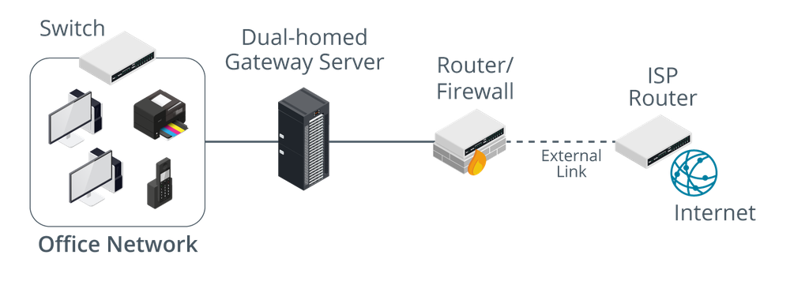

# Screened Hosts

#### SCREENED HOSTS

Smaller networks may not have the budget or technical expertise to implement a DMZ. In this case, Internet access can still be implemented using a dual-homed proxy/gateway server acting as a **screened host**.

_A screened host. (Images © 123RF.com.)_

Sometimes the term DMZ (or "DMZ host") is used by SOHO router vendors to mean a host on the local network that accepts connections from the Internet. This might be simpler to configure and solve some access problems, but it makes the whole network very vulnerable to intrusion and DoS. An enterprise DMZ is established by a separate network interface and subnet so that traffic between hosts in the DMZ and the LAN must be routed (and subject to firewall rules). Most SOHO routers do not have the necessary ports or routing functionality to create a true DMZ.