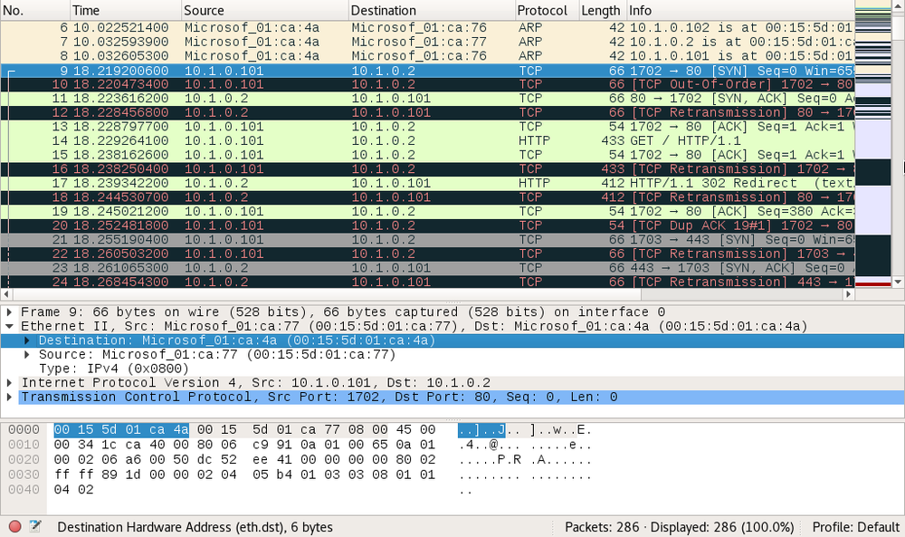

# ARP Poisoning and MAC Flooding Attacks

#### ARP POISONING AND MAC FLOODING ATTACKS

A host uses the **Address Resolution Protocol (ARP)** to discover the host on the local segment that owns an IP address.

**ARP Poisoning Attacks**  
An **ARP poisoning** attack uses a packet crafter, such as Ettercap, to broadcast unsolicited ARP reply packets. Because ARP has no security mechanism, the receiving devices trust this communication and update their MAC:IP address cache table with the spoofed address.

_Packet capture opened in Wireshark showing ARP poisoning. (Screenshot used with permission from [wireshark.org](https://course.adinusa.id/sections/arp-poisoning-and-mac-flooding-attacks).)_

This screenshot shows packets captured during a typical ARP poisoning attack:

-   In frames 6-8, the attacking machine (with MAC address ending :4a) directs gratuitous ARP replies at other hosts (:76 and :77), claiming to have the IP addresses .2 and .102.
    
-   In frame 9, the .101/:77 host tries to send a packet to the .2 host, but it is received by the attacking host (with the destination MAC :4a).
    
-   In frame 10, the attacking host retransmits frame 9 to the actual .2 host. Wireshark colors the frame black and red to highlight the retransmission.
    
-   In frames 11 and 12, you can see the reply from .2, received by the attacking host in frame 11 and retransmitted to the legitimate host in frame 12.
    

The usual target will be the subnet's default gateway (the router that accesses other networks). If the ARP poisoning attack is successful, all traffic destined for remote networks will be sent to the attacker. The attacker can perform a man-in-the-middle attack, either by monitoring the communications and then forwarding them to the router to avoid detection, or modifying the packets before forwarding them. The attacker could also perform a denial of service attack by not forwarding the packets.

**MAC Flooding Attacks**  
Where ARP poisoning is directed at hosts, **MAC flooding** is used to attack a switch. The intention of the attacker is to exhaust the memory used to store the switch's MAC address table. The switch uses the **MAC address table** to determine which port to use to forward unicast traffic to its correct destination. Overwhelming the table can cause the switch to stop trying to apply MAC-based forwarding and flood unicast traffic out of all ports, working as a hub. This makes sniffing network traffic easier for the threat actor.