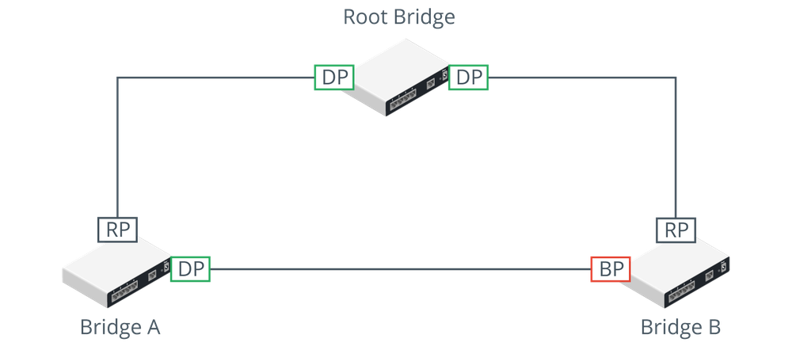

# Loop Prevention

#### LOOP PREVENTION

An Ethernet switch's layer 2 forwarding function is similar to that of an older network appliance called a bridge. In a network with multiple bridges, implemented these days as switches, there may be more than one path for a frame to take to its intended destination. As a layer 2 protocol, Ethernet has no concept of Time To Live. Therefore, layer 2 broadcast traffic could continue to loop through a network with multiple paths indefinitely. Layer 2 loops are prevented by the **Spanning Tree Protocol (STP)**. Spanning tree is a means for the bridges to organize themselves into a hierarchy and prevent loops from forming.

_STP configuration. (Images © 123RF.com.)_

This diagram shows the minimum configuration necessary to prevent loops in a network with three bridges or switches. The root bridge has two designated ports (DP) connected to Bridge A and Bridge B. Bridges A and B both have root ports (RP) connected back to the interfaces on the root bridge. Bridges A and B also have a connection directly to one another. On Bridge A, this interface is active and traffic for Bridge B can be forwarded directly over it. On Bridge B, the interface is blocked (BP) to prevent a loop and traffic for Bridge A must be forwarded via the root bridge.

**Broadcast Storm Prevention**  
STP is principally designed to prevent **broadcast storms**. Switches forward broadcast, multicast, and unknown unicast traffic out of all ports. If a bridged network contains a loop, broadcast traffic will travel through the network, get amplified by the other switches, and arrive back at the original switch, which will re-broadcast each incoming broadcast frame, causing an exponential increase (the storm), which will rapidly overwhelm the switches and crash the network.

A loop can be created accidentally or maliciously by plugging a patch cable from one patch panel port to another or connecting two wall ports. Normally, STP should detect and close the loop, resulting in a few seconds disruption and then ongoing poor performance. However, STP may be misconfigured or a threat actor may have managed to disrupt it. A storm control setting on a switch is a backup mechanism to rate-limit broadcast traffic above a certain threshold.

**Bridge Protocol Data Unit (BPDU) Guard**  
A threat actor might try to attack STP using a rogue switch or software designed to imitate a switch. When a switch does not know the correct port to use for a particular destination MAC address (if the cache has just been flushed, for instance), it floods the unknown unicast frame out to all ports. Topology changes in STP can cause a switch to flush the cache more frequently and to start flooding unicast traffic more frequently, which can have a serious impact on network performance and assists sniffing attacks.

The configuration of switch ports should prevent the use of STP over ports designated for client devices (access ports). An access port is configured with the portfast command to prevent STP changes from delaying client devices trying to connect to the port. Additionally, the **BPDU Guard** setting should be applied. This causes a portfast-configured port that receives a BPDU to become disabled ([cisco.com/c/en/us/td/docs/switches/lan/catalyst4000/8-2glx/configuration/guide/stp\_enha.html](https://course.adinusa.id/sections/loop-prevention)). Bridge Protocol Data Units (BPDUs) are used to communicate information about the topology and are not expected on access ports, so BPDU Guard protects against misconfiguration or a possible malicious attack.