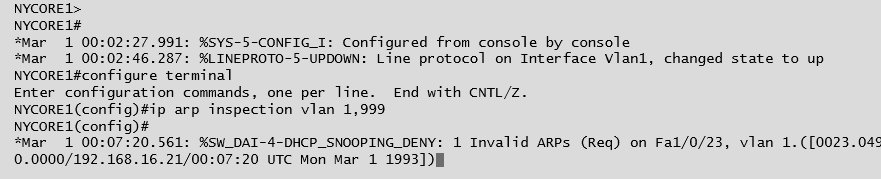

# Physical Port Security and MAC Filtering

#### PHYSICAL PORT SECURITY AND MAC FILTERING

Because of the risks from rogue devices and the potential to create loops by incorrect placement of patch cables, access to the physical switch ports and switch hardware should be restricted to authorized staff, using a secure server room and/or lockable hardware cabinets. To prevent the attachment of unauthorized client devices at unsecured wall ports, the switch port that the wall port cabling connects to can be disabled by using the management software, or the patch cable can be physically removed from the port. Completely disabling ports in this way can introduce a lot of administrative overhead and scope for error. Also, it doesn't provide complete protection, as an attacker could unplug a device from an enabled port and connect their own laptop. Consequently, more sophisticated methods of ensuring **port security** have been developed.

**MAC Filtering and MAC Limiting**  
Configuring **MAC filtering** on a switch means defining which MAC addresses are allowed to connect to a particular port. This can be done by creating a list of valid MAC addresses or by specifying a limit to the number of permitted addresses. For example, if port security is enabled with a maximum of two MAC addresses, the switch will record the first two MACs to connect to that port, but then drop any traffic from machines with different MAC addresses that try to connect ([cisco.com/c/en/us/td/docs/ios/lanswitch/command/reference/lsw\_book/lsw\_m1.html](https://course.adinusa.id/sections/physical-port-security-and-mac-filtering)). This provides a guard against MAC flooding attacks.

**DHCP Snooping**  
Another option is to configure **Dynamic Host Configuration Protocol (DHCP) snooping**. DHCP is the protocol that allows a server to assign IP address information to a client when it connects to the network. DHCP snooping inspects this traffic arriving on access ports to ensure that a host is not trying to spoof its MAC address. It can also be used to prevent rogue (or spurious) DHCP servers from operating on the network. With DHCP snooping, only DHCP messages from ports configured as trusted are allowed. Additionally dynamic ARP inspection (DAI), which can be configured alongside DHCP snooping, prevents a host attached to an untrusted port from flooding the segment with gratuitous ARP replies. DAI maintains a trusted database of IP:ARP mappings and ensures that ARP packets are validly constructed and use valid IP addresses ([cisco.com/c/en/us/td/docs/switches/lan/catalyst6500/ios/12-2SX/configuration/guide/book/snoodhcp.html](https://course.adinusa.id/sections/physical-port-security-and-mac-filtering)).

_Configuring ARP inspection on a Cisco switch._