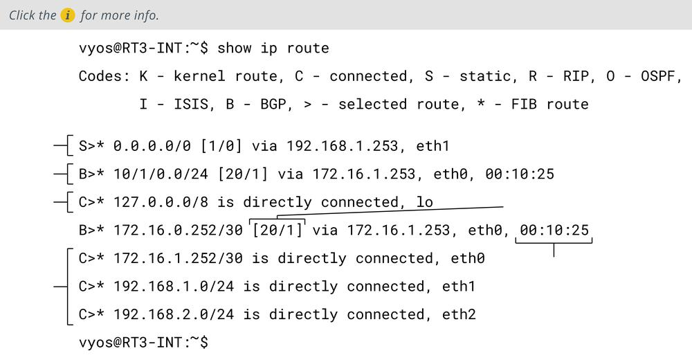

# Route Security

#### ROUTE SECURITY

A successful attack against route security enables the attacker to redirect traffic from its intended destination. On the Internet, this may allow the threat actor to herd users to spoofed websites. On an enterprise network, it may facilitate circumventing firewalls and security zones to allow lateral movement and data exfiltration.

Routes between networks and subnets can be configured manually, but most routers automatically discover routes by communicating with each other. Dynamic routers exchange information about routes using routing protocols. It is important that this traffic be separated from channels used for other types of data. Routing protocols do not always have effective integral security mechanisms, so they need to run in an environment where access is very tightly controlled.

_Sample routing table showing routes obtained from different sources, such as static configuration, direct connection, and learned from the Border Gateway Protocol (BGP) routing protocol._

Routing is subject to numerous vulnerabilities, including:

-   Spoofed routing information (route injection)—Routing protocols that have no or weak authentication are vulnerable to route table poisoning. This can mean that traffic is misdirected to a monitoring port (sniffing), sent to a blackhole (nonexistent address), or continuously looped around the network, causing DoS. Most dynamic routing protocols support message authentication via a shared secret configured on each device. This can be difficult to administer, however. It is usually also possible to configure how a router identifies the peers from which it will accept route updates. This makes it harder to simply add a rogue router to the system. An attacker would have to compromise an existing router and change its configuration.
    
-   Source routing—This uses an option in the IP header to pre-determine the route a packet will take through the network (strict) or "waypoints" that it must pass through (loose). This can be used maliciously to spoof IP addresses and bypass router/firewall filters. Routers can be configured to block source routed packets.
    
-   Software exploits in the underlying operating system—Hardware routers (and switches) have an embedded operating system. For example, Cisco devices typically use the Internetwork Operating System (IOS). Something like IOS suffers from fewer exploitable vulnerabilities than full network operating systems. It has a reduced attack surface compared to a computer OS, such as Windows.
    

> _On the other hand, SOHO broadband routers can be particularly vulnerable to unpatched exploits._