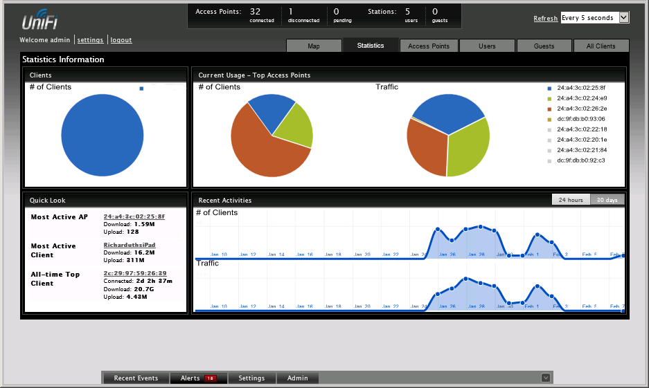

# Controller and Access Point Security

#### CONTROLLER AND ACCESS POINT SECURITY

Where a site survey ensures availability, the confidentiality and integrity properties of the network are ensured by configuring authentication and encryption. These settings could be configured manually on each WAP, but this would be onerous in an enterprise network with tens or hundreds of WAP. If access points are individually managed, this can lead to configuration errors and can make it difficult to gain an overall view of the wireless deployment, including which clients are connected to which access points and which clients or access points are handling the most traffic.

Rather than configure each device individually, enterprise wireless solutions implement **wireless controllers** for centralized management and monitoring. A controller can be a hardware appliance or a software application run on a server.

_UniFi Wireless Network management console. (Screenshot used with permission from Ubiquiti Networks.)_

An access point whose firmware contains enough processing logic to be able to function autonomously and handle clients without the use of a wireless controller is known as a fat WAP, while one that requires a wireless controller in order to function is known as a thin WAP.

Controllers and access points must be made physically secure, as tampering could allow a threat actor to insert a rogue/evil twin WAP to try to intercept logons. These devices must be managed like switches and routers, using secure management interfaces and strong administrative credentials.