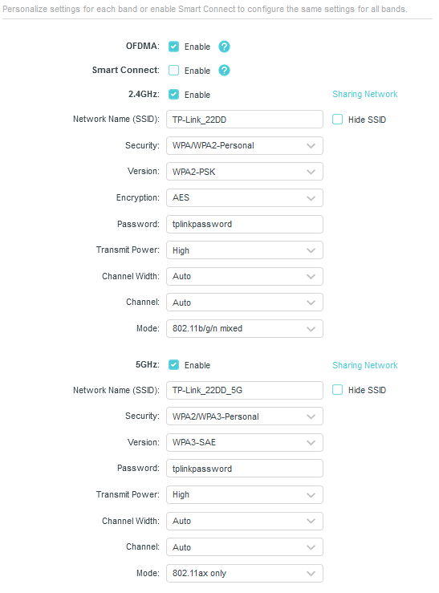

# Wi-Fi Protected Access

#### WI-FI PROTECTED ACCESS

As well as the site design, a wireless network must be configured with security settings. Without encryption, anyone within range can intercept and read packets passing over the wireless network. These choices are determined by device support for the various Wi-Fi security standards, by the type of authentication infrastructure, and by the purpose of the WLAN. The security standard determines the cryptographic protocols that are supported, the means of generating the encryption key, and available methods for authenticating wireless stations when they try to join (or associate with) the network.

The first version of **Wi-Fi Protected Access (WPA)** was designed to fix critical vulnerabilities in the earlier **wired equivalent privacy (WEP)** standard. Like WEP, version 1 of WPA uses the RC4 stream cipher but adds a mechanism called the **Temporal Key Integrity Protocol (TKIP)** to make it stronger.

_Configuring a TP-LINK SOHO access point with wireless encryption and authentication settings. In this example, the 2.4 GHz band allows legacy connections with WPA2-Personal security, while the 5 GHz network is for 802.11ax (Wi-Fi 6) capable devices using WPA3-SAE authentication. (Screenshot used with permission from TP-Link Technologies.)_

Neither WEP nor the original WPA version are considered secure enough for continued use. WPA2 uses the Advanced Encryption Standard (AES) cipher with 128-bit keys, deployed within the Counter Mode with Cipher Block Chaining Message Authentication Code Protocol (CCMP). AES replaces RC4 and CCMP replaces TKIP. CCMP provides authenticated encryption, which is designed to make replay attacks harder.

Weaknesses have also been found in WPA2, however, which has led to its intended replacement by WPA3. The main features of WPA3 are as follows:

-   **Simultaneous Authentication of Equals (SAE)**—replaces WPA's 4-way handshake authentication and association mechanism with a protocol based on Diffie-Hellman key agreement.
    
-   Enhanced Open—enables encryption for the open authentication method.
    
-   Updated cryptographic protocols—replaces AES CCMP with the **AES Galois Counter Mode Protocol (GCMP)** mode of operation. Enterprise authentication methods must use 192-bit AES, while personal authentication can use either 128-bit or 192-bit.
    
-   Management protection frames—mandates use of these to protect against key recovery attacks.
    

> _Wi-Fi performance also depends on support for the latest 802.11 standards. The most recent generation (802.11ax) is being marketed as Wi-Fi 6. The earlier standards are retroactively named Wi-Fi 5 (802.11ac) and Wi-Fi 4 (802.11n). The performance standards are developed in parallel with the WPA security specifications. Most Wi-Fi 6 devices and some Wi-Fi 5 and Wi-Fi 4 products should support WPA3, either natively or with a firmware/driver update._