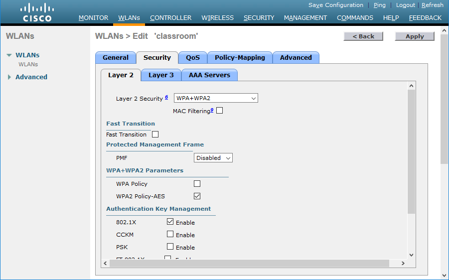

# Enterprise/IEEE 802.1X Authentication

#### ENTERPRISE/IEEE 802.1X AUTHENTICATION

The main problems with personal modes of authentication are that distribution of the key or passphrase cannot be secured properly, and users may choose unsecure phrases. Personal authentication also fails to provide accounting, as all users share the same key.

As an alternative to personal authentication, the enterprise authentication method implements IEEE 802.1X to use an Extensible Authentication Protocol (EAP) mechanism. 802.1X defines the use of EAP over Wireless (EAPoW) to allow an access point to forward authentication data without allowing any other type of network access. It is configured by selecting WPA2-Enterprise or WPA3-Enterprise as the security method on the access point.

With enterprise authentication, when a wireless station requests an association, the WAP enables the channel for EAPoW traffic only. It passes the credentials of the supplicant to an AAA (RADIUS or TACACS+) server on the wired network for validation. When the supplicant has been authenticated, the AAA server transmits a master key (MK) to the supplicant. The supplicant and authentication server then derive the same pairwise master key (PMK) from the MK. The AAA server transmits the PMK to the the access point. The wireless station and access point use the PMK to derive session keys, using either the WPA2 4-way handshake or WPA3 SAE methods.

> _See [tldp.org/HOWTO/8021X-HOWTO/intro.html](https://course.adinusa.id/sections/enterpriseieee-8021x-authentication) for more detailed information about the keys used._

_Using Cisco's Virtual Wireless LAN Controller to set security policies for a WLAN—this policy enforces use of WPA2 and the use of 802.1X (Enterprise) authentication. (Screenshot used with permission from Cisco.)_
