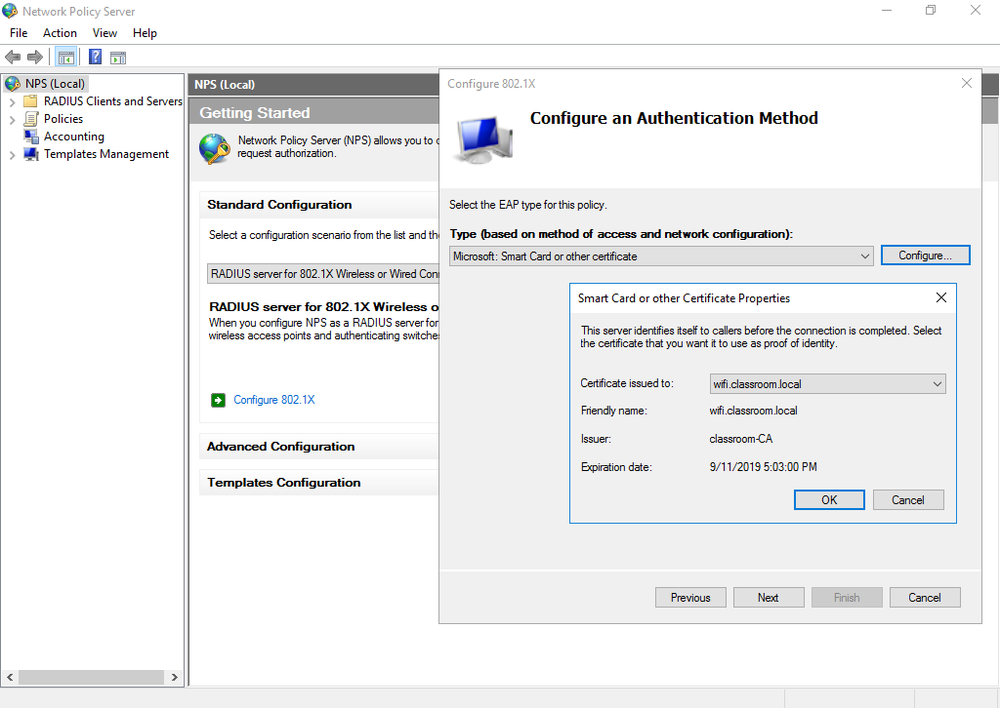

# Extensible Authentication Protocol

#### EXTENSIBLE AUTHENTICATION PROTOCOL

The Extensible Authentication Protocol (EAP) defines a framework for negotiating authentication mechanisms rather than the details of the mechanisms themselves. Vendors can write extensions to the protocol to support third-party security devices. EAP implementations can include smart cards, one-time passwords, biometric identifiers, or simpler username and password combinations.

**EAP-TLS** is one of the strongest types of authentication and is very widely supported. An encrypted Transport Layer Security (TLS) tunnel is established between the supplicant and authentication server using public key certificates on the authentication server and supplicant. As both supplicant and server are configured with certificates, this provides mutual authentication. The supplicant will typically provide a certificate using a smart card or a certificate could be installed on the client device, possibly in a Trusted Platform Module (TPM).

_Configuring Network Policy Server to authenticate wireless clients using 802.1X EAP-TLS. (Screenshot used with permission from Microsoft.)_