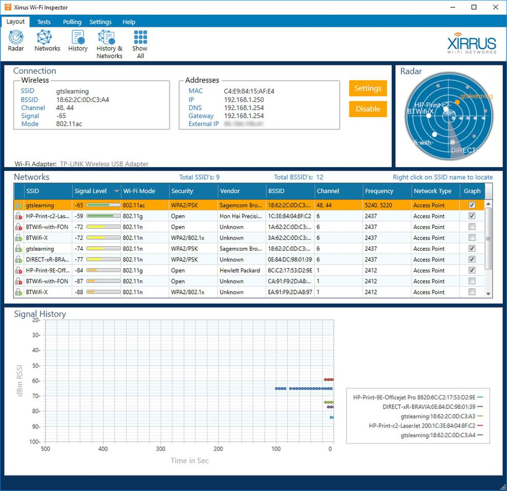

# Rogue Access Points and Evil Twins

#### ROGUE ACCESS POINTS AND EVIL TWINS

A rogue access point is one that has been installed on the network without authorization, whether with malicious intent or not. It is vital to periodically survey the site to detect rogue WAPs. A malicious user can set up such an access point with something as basic as a smartphone with tethering capabilities, and a non-malicious user could enable such an access point by accident. If connected to a LAN without security, an unauthorized WAP creates a backdoor through which to attack the network. A rogue WAP could also be used to capture user logon attempts, allow man-in-the-middle attacks, and allow access to private information.

A rogue WAP masquerading as a legitimate one is called an evil twin. An **evil twin** might just have a similar name (SSID) to the legitimate one, or the attacker might use some DoS technique to overcome the legitimate WAP. This attack will not succeed if authentication security is enabled on the WAP, unless the attacker also knows the details of the authentication method. However, the evil twin might be able to harvest authentication information from users entering their credentials by mistake.

_Surveying Wi-Fi networks using Cambium Networks (formerly Xirrus) Wi-Fi Inspector—Note the presence of print devices configured with open authentication (no security) and a smart TV appliance (requiring authentication). (Screenshot used with permission from Xirrus.)_

A rogue hardware WAP can be identified through physical inspections. There are also various Wi-Fi analyzers and monitoring systems that can detect rogue WAPs, including inSSIDer (metageek.com/products/inssider), Kismet ([kismetwireless.net](https://course.adinusa.id/sections/rogue-access-points-and-evil-twins)), and Cambium Networks (formerly Xirrus) Wi-Fi Inspector ([cambiumnetworks.com/products/software/wifi-designer-and-wifi-inspector](https://course.adinusa.id/sections/rogue-access-points-and-evil-twins)).