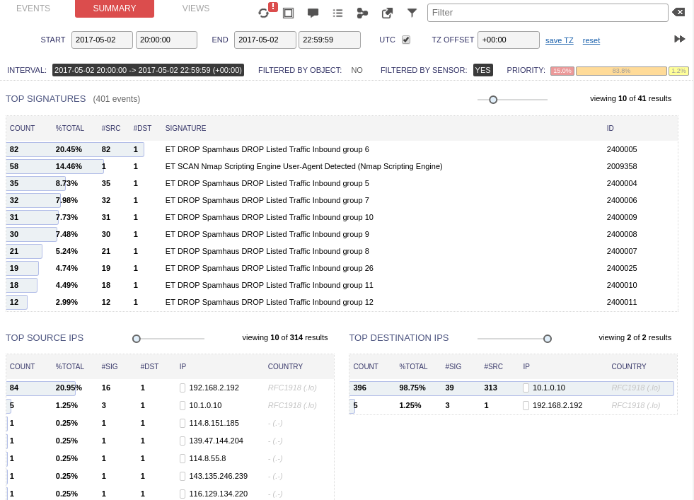

# Distributed Denial of Service Attack Mitigation

#### DISTRIBUTED DENIAL OF SERVICE ATTACK MITIGATION

DDoS attacks can be diagnosed by traffic spikes that have no legitimate explanation, but can usually only be counteracted by providing high availability services, such as load balancing and cluster services. In some cases, a stateful firewall can detect a DDoS attack and automatically block the source. However, for many of the techniques used in DDoS attacks, the source addresses will be randomly spoofed or launched by bots, making it difficult to detect the source of the attack.

_Dropping traffic from block-listed IP ranges using Security Onion IDS. (Screenshot used with permission from Security Onion.)_

When a network is faced with a DDoS or similar flooding attack, an ISP can use either an access control list (ACL) or a blackhole to drop packets for the affected IP address(es). A blackhole is an area of the network that cannot reach any other part of the network. The blackhole option is preferred, as evaluating each packet in a multi-gigabit stream against ACLs overwhelms the processing resources available. A standard method of doing this with border gateway protocol (BGP) routing is called a **remotely triggered blackhole (RTBH)** ([cisco.com/c/dam/en\_us/about/security/intelligence/blackhole.pdf](https://course.adinusa.id/sections/distributed-denial-of-service-attack-mitigation)). The blackhole also makes the attack less damaging to the ISP's other customers. With both approaches, legitimate traffic is discarded along with the DDoS packets.

Another option is to use **sinkhole** routing so that the traffic flooding a particular IP address is routed to a different network where it can be analyzed. Potentially some legitimate traffic could be allowed through, but the real advantage is to identify the source of the attack and devise rules to filter it. The target can then use low TTL DNS records to change the IP address advertised for the service and try to allow legitimate traffic past the flood.

> _There are cloud DDoS mitigation services that can act as sinkhole network providers and try to "scrub" flooded traffic._