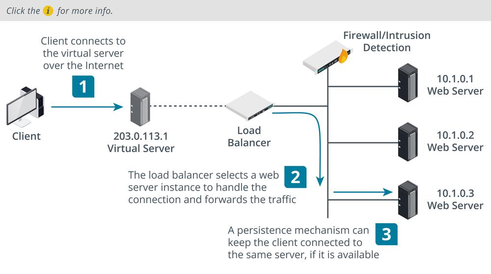

# Load Balancing

#### LOAD BALANCING

A **load balancer** distributes client requests across available server nodes in a farm or pool. This is used to provision services that can scale from light to heavy loads, and to provide mitigation against DDoS attacks. A load balancer also provides fault tolerance. If there are multiple servers available in a farm, all addressed by a single name/IP address via a load balancer, then if a single server fails, client requests can be routed to another server in the farm. You can use a load balancer in any situation where you have multiple servers providing the same function. Examples include web servers, front-end email servers, and web conferencing, A/V conferencing, or streaming media servers.

There are two main types of load balancers:

-   Layer 4 load balancer—basic load balancers make forwarding decisions on IP address and TCP/UDP port values, working at the transport layer of the OSI model.
    
-   Layer 7 load balancer (content switch)—as web applications have become more complex, modern load balancers need to be able to make forwarding decisions based on application-level data, such as a request for a particular URL or data types like video or audio streaming. This requires more complex logic, but the processing power of modern appliances is sufficient to deal with this.

_Topology of basic load balancing architecture. (Images © 123RF.com.)_

**Scheduling**  
The scheduling algorithm is the code and metrics that determine which node is selected for processing each incoming request. The simplest type of scheduling is called round robin; this just means picking the next node. Other methods include picking the node with the fewest connections or the best response time. Each method can also be weighted, using administrator set preferences or dynamic load information or both.

The load balancer must also use some type of heartbeat or health check probe to verify whether each node is available and under load or not. Layer 4 load balancers can only make basic connectivity tests while layer 7 appliances can test the application's state, as opposed to only verifying host availability.

**Source IP Affinity and Session Persistence**  
When a client device has established a session with a particular node in the server farm, it may be necessary to continue to use that connection for the duration of the session. Source IP or **session affinity** is a layer 4 approach to handling user sessions. It means that when a client establishes a session, it becomes stuck to the node that first accepted the request.

An application-layer load balancer can use **persistence** to keep a client connected to a session. Persistence typically works by setting a cookie, either on the node or injected by the load balancer. This can be more reliable than source IP affinity, but requires the browser to accept the cookie.