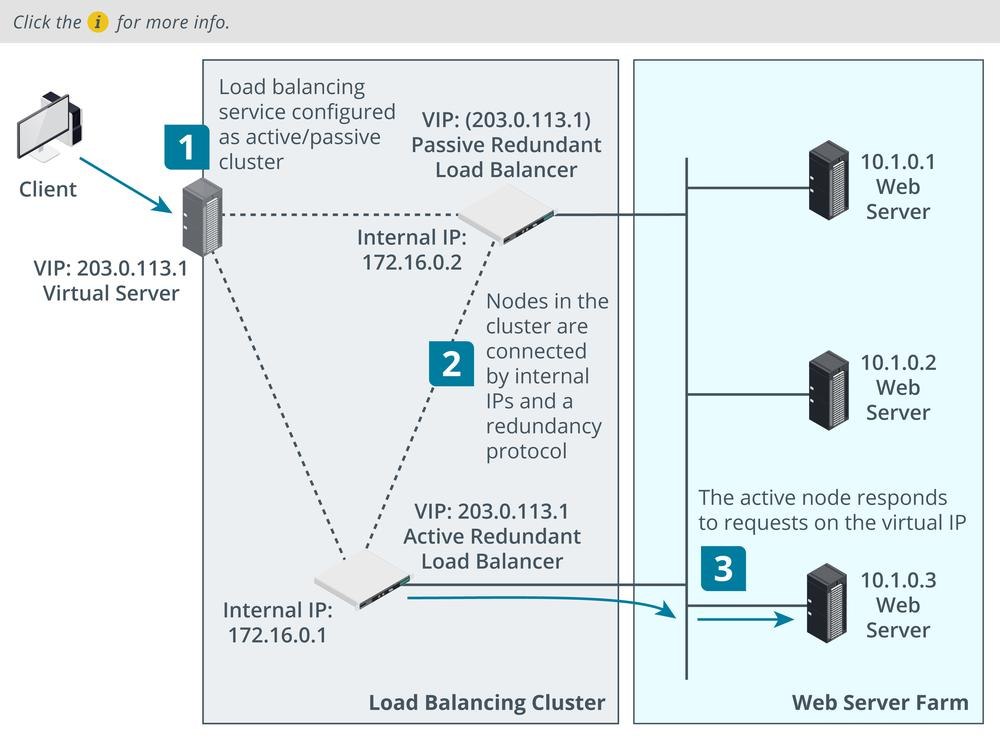

# Clustering

#### CLUSTERING

Where load balancing distributes traffic between independent processing nodes, **clustering** allows multiple redundant processing nodes that share data with one another to accept connections. This provides redundancy. If one of the nodes in the cluster stops working, connections can **failover** to a working node. To clients, the cluster appears to be a single server.

**Virtual IP**  
For example, you might want to provision two load balancer appliances so that if one fails, the other can still handle client connections. Unlike load balancing with a single appliance, the public IP used to access the service is shared between the two instances in the cluster. This is referred to as a virtual IP or shared or floating address. The instances are configured with a private connection, on which each is identified by its "real" IP address. This connection runs some type of redundancy protocol, such as Common Address Redundancy Protocol (CARP), that enables the active node to "own" the virtual IP and respond to connections. The redundancy protocol also implements a heartbeat mechanism to allow failover to the passive node if the active one should suffer a fault.

_Topology of clustered load balancing architecture. (Images © 123RF.com.)_

**Active/Passive (A/P) and Active/Active (A/A) Clustering**  
In the previous example, if one node is active, the other is passive. This is referred to as active/passive clustering. The major advantage of active/passive configurations is that performance is not adversely affected during failover. However, the hardware and operating system costs are higher because of the unused capacity.

An active/active cluster means that both nodes are processing connections concurrently. This allows the administrator to use the maximum capacity from the available hardware while all nodes are functional. In the event of a failover the workload of the failed node is immediately and transparently shifted onto the remaining node. At this time, the workload on the remaining nodes is higher and performance is degraded.

> _In a standard active/passive configuration, each active node must be matched by a passive node. There are N+1 and N+M configurations that provision fewer passive nodes than active nodes, to reduce costs._

**Application Clustering**  
Clustering is also very commonly used to provision fault tolerant application services. If an application server suffers a fault in the middle of a session, the session state data will be lost. Application clustering allows servers in the cluster to communicate session information to one another. For example, if a user logs in on one instance, the next session can start on another instance, and the new server can access the cookies or other information used to establish the login.